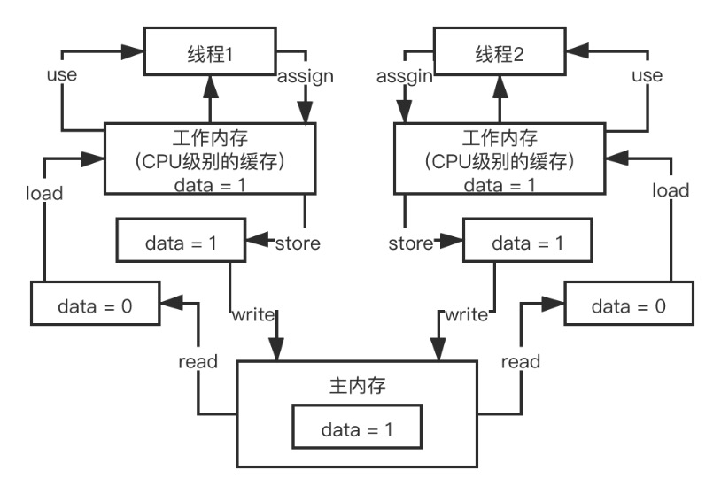

#### 1、内存模型
JMM是一种规范，目的是解决由于多线程通过共享内存进行通信时，存在的本地内存数据不一致、编译器会对代码指令重排序、处理器会对代码乱序执行等带来的问题。目的是保证并发编程场景中的原子性、可见性和有序性。

- 原子性
在Java中，为了保证原子性，提供了两个高级的字节码指令monitorenter和monitorexit。在synchronized的实现原理文章中，介绍过，这两个字节码，在Java中对应的关键字就是synchronized,因此，在Java中可以使用synchronized来保证方法和代码块内的操作是原子性的。
- 可见性:Java内存模型是通过在变量修改后将新值同步回主内存，在变量读取前从主内存刷新变量值的这种依赖主内存作为传递媒介的方式来实现的,Java中的volatile关键字提供了一个功能，那就是被其修饰的变量在被修改后向cpu发lock指令，可以立即同步到主内存，被其修饰的变量在每次是用之前都从主内存刷新。因此，可以使用volatile来保证多线程操作时变量的可见性。除了volatile，Java中的synchronized和final两个关键字也可以实现可见性。只不过实现方式不同，这里不再展开了。
- 有序性
在Java中，可以使用synchronized和volatile来保证多线程之间操作的有序性。实现方式有所区别：volatile关键字通过内存屏障禁止指令重排。synchronized关键字保证同一时刻只允许一条线程操作。

#### 2、happens-before
- 如果ActionA和ActionB属于同一个线程，那么就说明ActionA happens-before ActionB。
- 如果ActionA是unlock操作，而ActionB是lock操作，那么ActionA happens-before ActionB。
- 如果A是对volatile变量的写操作，ActionB是对同一个变量的读操作，那么ActionA happens-before ActionB。
- 线程的启动Action happens-before 该线程上的其他动作。
- 线程中任何Action都 happens-before 任何其他线程检测到该线程已经结束、Thread.join调用成功返回，Thread.isAlive返回false。
- 一个线程调用另一个线程的interrupt一定发生在另一个线程中断之前。
- 一个对象的构造函数结束一定发生在兑现finalizer之前。
- ActionA发生在ActionB之前，ActionB发生在ActionC之前，则ActionA一定发生在ActionC之前。ActionA happends-before ActionB，记作hb（ActionA，ActionB）。
