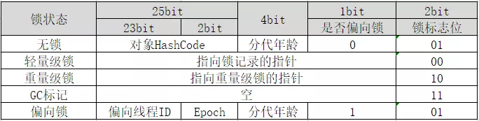

#### 1、自旋锁
请求获取锁，又不能马上获取到时，让当前线程在不放弃处理器执行时间的情况下执行忙循环，尝试等待锁被释放，再获取锁。引入自旋锁是为了节省线程挂起和恢复的开销。

#### 2、自适应自旋锁
自旋的次数由前一次在同一个锁上的自旋次数和锁的拥有者的状态来决定。如果前面线程成功获取锁并且正常运行，那么本次获取锁的可能性很大，所以自旋的次数相对多一些；如果前面线程很少成功获取锁，那么本次获取锁的概率也很小，就可能不执行自旋了。

#### 3、锁粗化
一段代码中同一线程反复获取、释放同一个对象的锁，将会生产不必要的性能开销，所以需要把获锁的范围扩大，对同一个对象的锁操作只进行一次，在头部获取锁，在尾部释放锁。

#### 4、锁消除
运行时分析到使用了锁的同步代码在实际运行时不可能存在共享数据被竞争的情况，对锁进行去除。例如如果一个局部变量在方法内部不可能被外部引用，那么它就不需要加锁控制，可以去掉锁。

#### 5、偏向锁
线程持有了锁，在后续的过程中，只要该锁没有被其它线程持有，那么持有偏向锁的线程将不再需要进行同步操作。这个偏向锁的相关信息是保存在Java对象的对象头中的。

#### 6、锁升级
偏向所锁，轻量级锁都是乐观锁，重量级锁是悲观锁。
一个对象刚开始实例化的时候，没有任何线程来访问它的时候。它是可偏向的，意味着，它现在认为只可能有一个线程来访问它，所以当第一个
线程来访问它的时候，它会偏向这个线程，此时，对象持有偏向锁。偏向第一个线程，这个线程在修改对象头成为偏向锁的时候使用CAS操作，并将
对象头中的ThreadID改成自己的ID，之后再次访问这个对象时，只需要对比ID，不需要再使用CAS在进行操作。
一旦有第二个线程访问这个对象，因为偏向锁不会主动释放，所以第二个线程可以看到对象时偏向状态，这时表明在这个对象上已经存在竞争了，检查原来持有该对象锁的线程是否依然存活，如果挂了，则可以将对象变为无锁状态，然后重新偏向新的线程，如果原来的线程依然存活，则马上执行那个线程的操作栈，检查该对象的使用情况，如果仍然需要持有偏向锁，则偏向锁升级为轻量级锁，（偏向锁就是这个时候升级为轻量级锁的）。如果不存在使用了，则可以将对象回复成无锁状态，然后重新偏向。
轻量级锁认为竞争存在，但是竞争的程度很轻，一般两个线程对于同一个锁的操作都会错开，或者说稍微等待一下（自旋），另一个线程就会释放锁。 但是当自旋超过一定的次数，或者一个线程在持有锁，一个在自旋，又有第三个来访时，轻量级锁膨胀为重量级锁，重量级锁使除了拥有锁的线程以外的线程都阻塞，防止CPU空转
