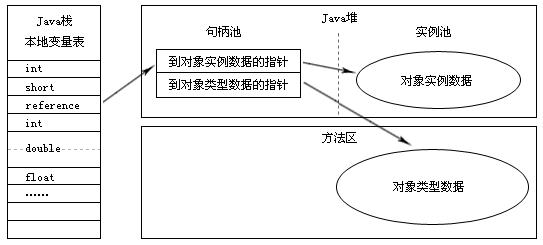
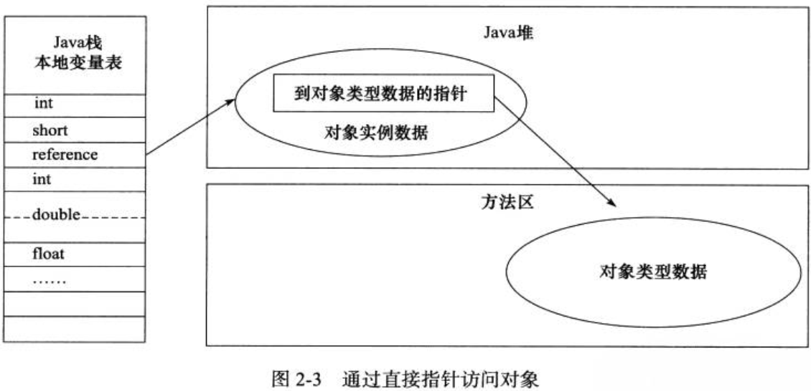

#### 1、对象创建
当虚拟机碰到一个new指令时，首先检查指令参数能否在常量池中定位一个类的符号引用，并且检查该符号引用对应的类是否已经被加载，解析和初始化。当一切都确定完成后，JVM就会为其分配内存(需要分配的内存大小在现在就已经确定，在 下面 中详细讲述)。
对象的内存分配方式分为以下两种：
- 指针碰撞，这种分配方式建立在堆内已用空间和剩余空间是完整的，这样的话，在两者之间放置一个指针作为分界点的指示器即可，在分配空间时，只需要移到一下指针位置就好了。
- 空闲列表，如果 JVM 内的空间不是规整的，那么就只能采用此方案了。此时 JVM 会维护一个列表，记录了哪些内存块是可用的，在分配的时候划一个大小足够的区域给对象实例，并更新列表即可。
```
以上两种方式采取哪种，取决于 Java 堆是否工整，而堆是否工整又取决于垃圾回收算法是否具有整理功能。
```

#### 2、对象模型
java对象分为三部份：对象头、实例数据、对齐填充
- 对象头
 - Mark World:存储自身运行数据，包括Hashcode、GC 分代年龄、锁状态标志、线程持有锁、偏向线程ID、偏向时间戳等
 
 - 类型指针：即对象指向其类元数据的指针。通过这个指针，我们就可以知道该实例属于哪个类
- 实例数据：实例数据就是对象真正存储的有效信息，也就是代码中定义的各种类型的字段内容
- 对齐填充：因为 HotSpot 要求对象起始地址必须是8的整数倍，这样在实例数据达不到要求的时候，就需要通过对齐填充来补齐

#### 3、对象访问
- 句柄池：在 Java 堆中会独立创建一个句柄池，引用指向句柄，而句柄指向实例数据和类型数据。
 - 优点：实例数据需要移动，那么只需要修改句柄池中的内容即可，reference 指向的是稳定的位置
 - 缺点：需要二次定位


- 直接指针：引用直接堆中对象地址，堆中保存了实例数据和类型数据指针，指针直接指向另外存储的类型数据。
 - 优点:访问实例数据快，因为 reference 指向直接的对象，省去了一次内存定位开销
 - 缺点:就是不够稳定，在对象移动后，reference 也需要修改值。


