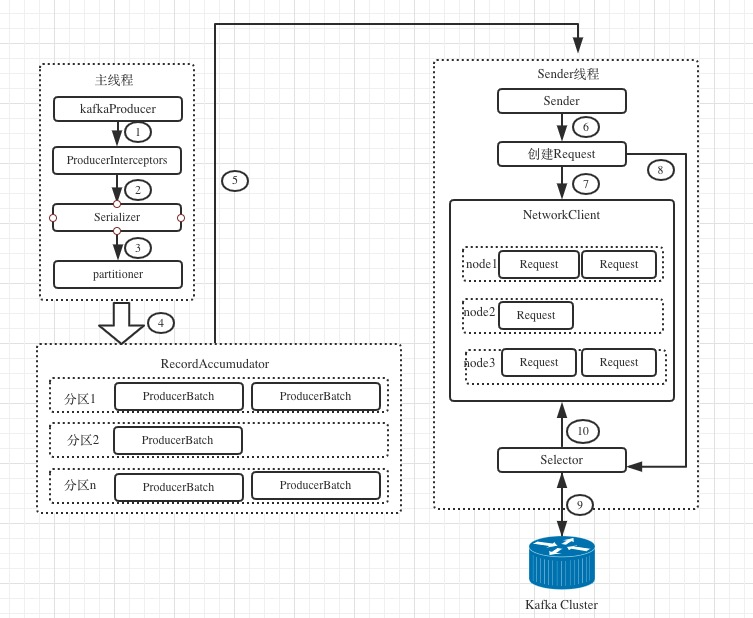
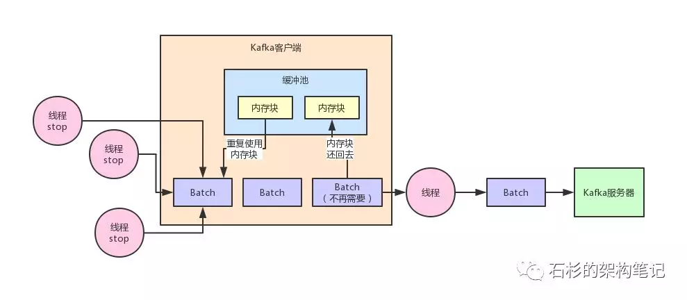

#### 1.整体架构
主要由主线程和Sender线程组成

- RecordAccumulator:缓存消息，方便Sender批量发送。

 - Deque<ProduceBatch>:内部为每个分区维护一个双端队列，队列中内容就是ProduceBatch,消息写入缓存时，加到队列尾部，Sender从头部读取消息(通过buffer.memory设置大小)；
 - ProduceBatch:通过BufferPool来管理进行复用，超过batch.size消息直接创建，不通过BufferPool管理

- Sender:将<Partition,Deque<ProduceBatch>>,转化成<Node,List<ProduceBatch>>,最终以<Node,Request>的形式，发往各个Node.

#### 2. producer 主要参数设置
##### 2.1 producer 参数acks 设置（无数据丢失）
在消息被认为是“已提交”之前，producer需要leader确认的produce请求的应答数。该参数用于控制消息的持久性，目前提供了3个取值：
- acks = 0: 表示produce请求立即返回，不需要等待leader的任何确认。这种方案有最高的吞吐率，但是不保证消息是否真的发送成功。
- acks = -1: 表示分区leader必须等待消息被成功写入到所有的ISR副本(同步副本)中才认为produce请求成功。这种方案提供最高的消息持久性保证，但是理论上吞吐率也是最差的。
- acks = 1: 表示leader副本必须应答此produce请求并写入消息到本地日志，之后produce请求被认为成功。如果此时leader副本应答请求之后挂掉了，消息会丢失。这是个这种的方案，提供了不错的持久性保证和吞吐。
###### 商业环境推荐：
如果要较高的持久性要求以及无数据丢失的需求，设置acks = -1。其他情况下设置acks = 1

##### 2.2 producer参数 buffer.memory 设置（吞吐量）
该参数用于指定Producer端用于缓存消息的缓冲区大小，单位为字节，默认值为：33554432合计为32M。kafka采用的是异步发送的消息架构，prducer启动时会首先创建一块内存缓冲区用于保存待发送的消息，然后由一个专属线程负责从缓冲区读取消息进行真正的发送。
###### 商业环境推荐：
消息持续发送过程中，当缓冲区被填满后，producer立即进入阻塞状态直到空闲内存被释放出来，这段时间不能超过max.blocks.ms设置的值，一旦超过，producer则会抛出TimeoutException 异常，因为Producer是线程安全的，若一直报TimeoutException，需要考虑调高buffer.memory 了。
用户在使用多个线程共享kafka producer时，很容易把 buffer.memory 打满。

##### 2.3  producer参数 compression.type 设置（lZ4）
producer压缩器，目前支持none（不压缩），gzip，snappy和lz4。
###### 商业环境推荐：
基于公司物联网平台，试验过目前lz4的效果最好。当然2016年8月，FaceBook开源了Ztandard。官网测试： Ztandard压缩率为2。8，snappy为2.091，LZ4 为2.101 。

##### 2.4  producer参数 retries设置(注意消息乱序,EOS)
producer重试的次数设置。重试时producer会重新发送之前由于瞬时原因出现失败的消息。瞬时失败的原因可能包括：元数据信息失效、副本数量不足、超时、位移越界或未知分区等。倘若设置了retries > 0，那么这些情况下producer会尝试重试。
###### 商业环境推荐：
producer还有个参数：max.in.flight.requests.per.connection。如果设置该参数大约1，那么设置retries就有可能造成发送消息的乱序。
版本为0.11.1.0的kafka已经支持"精确到一次的语义”，因此消息的重试不会造成消息的重复发送。

##### 2.5  producer参数batch.size设置(吞吐量和延时性能)
producer都是按照batch进行发送的，因此batch大小的选择对于producer性能至关重要。producer会把发往同一分区的多条消息封装进一个batch中，当batch满了后，producer才会把消息发送出去。但是也不一定等到满了，这和另外一个参数linger.ms有关。默认值为16K，合计为16384.
###### 商业环境推荐：
batch 越小，producer的吞吐量越低，越大，吞吐量越大。

##### 2.6  producer参数linger.ms设置(吞吐量和延时性能)
producer是按照batch进行发送的，但是还要看linger.ms的值，默认是0，表示不做停留。这种情况下，可能有的batch中没有包含足够多的produce请求就被发送出去了，造成了大量的小batch，给网络IO带来的极大的压力。
###### 商业环境推荐：
为了减少了网络IO，提升了整体的TPS。假设设置linger.ms=5，表示producer请求可能会延时5ms才会被发送。

##### 2.7  producer参数max.in.flight.requests.per.connection设置(吞吐量和延时性能)
producer的IO线程在单个Socket连接上能够发送未应答produce请求的最大数量。增加此值应该可以增加IO线程的吞吐量，从而整体上提升producer的性能。不过就像之前说的如果开启了重试机制，那么设置该参数大于1的话有可能造成消息的乱序。
###### 商业环境推荐：
默认值5是一个比较好的起始点,如果发现producer的瓶颈在IO线程，同时各个broker端负载不高，那么可以尝试适当增加该值.
过大增加该参数会造成producer的整体内存负担，同时还可能造成不必要的锁竞争反而会降低TPS
