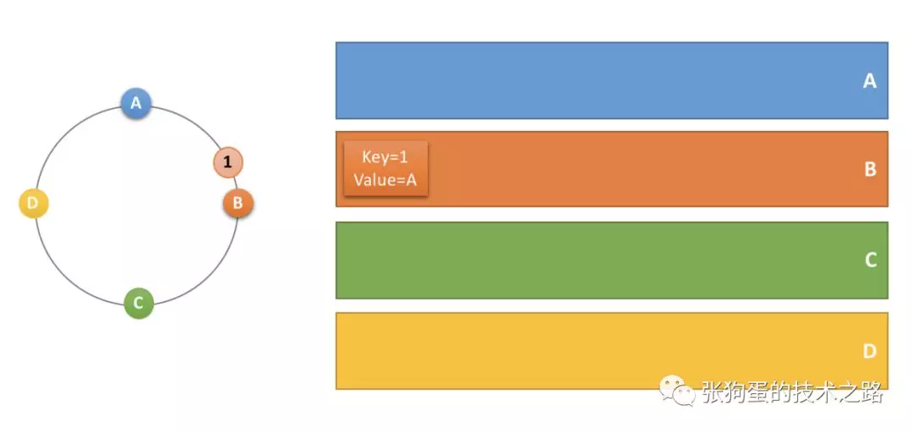
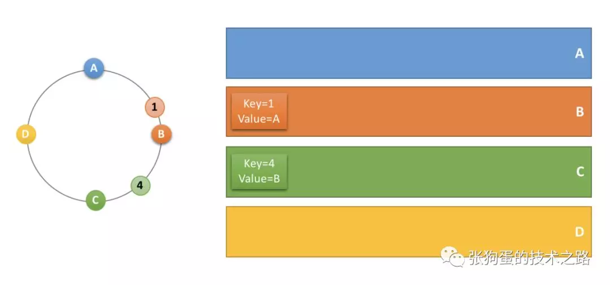
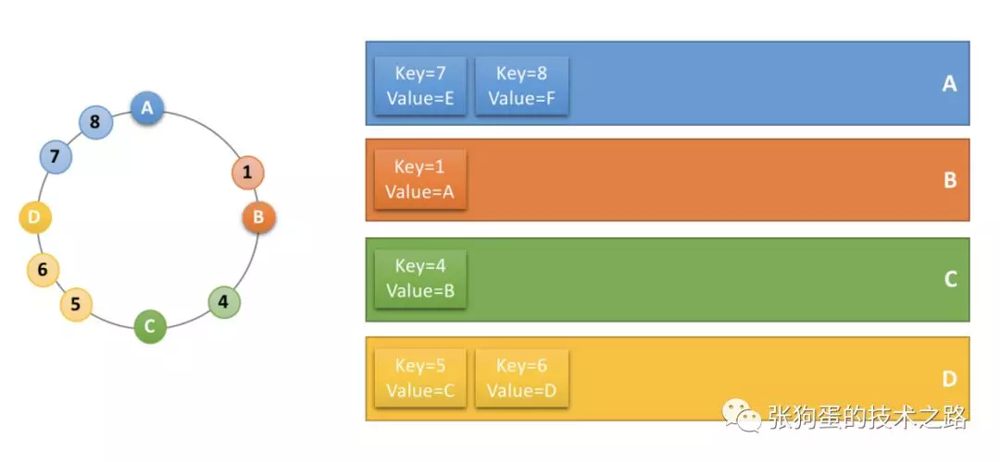
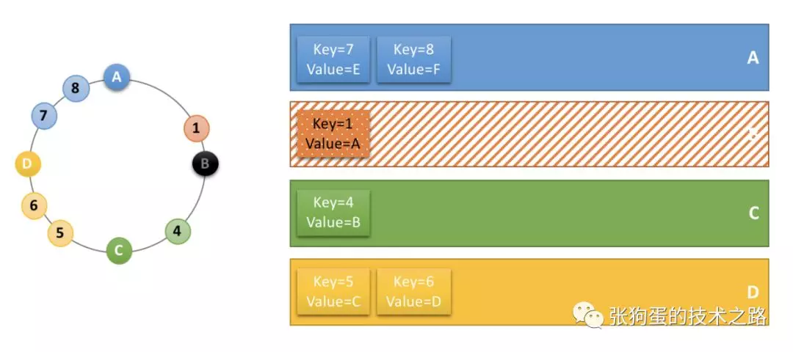
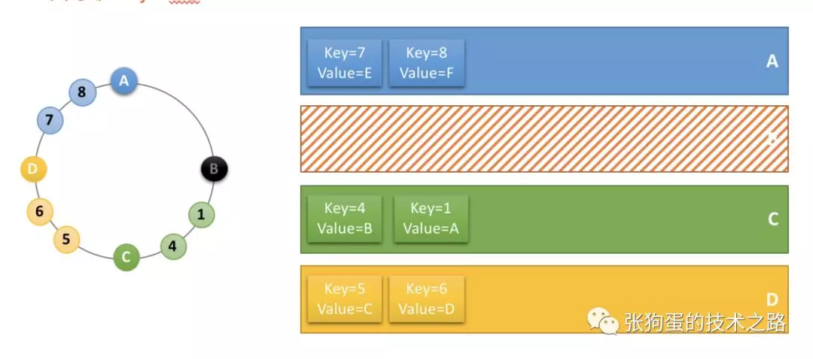

#### 1、原理
以分布式缓存场景为例，分析一下一致性哈希算法环的原理。

首先将缓存服务器（ ip + 端口号）进行哈希，映射成环上的一个节点，计算出缓存数据 key 值的 hash key，同样映射到环上，并顺时针选取最近的一个服务器节点作为该缓存应该存储的服务器。具体实现见后续的章节。

比如说，当存在 A，B，C，D 四个缓存服务器时，它们及其 key 值为1的缓存数据在一致性哈希环上的位置如下图所示，根据顺时针取最近一个服务器节点的规则，该缓存数据应该存储在服务器 B 上。

当要存储一个 key 值为4的缓存数据时，它在一致性哈希环上的位置如下所示，所以它应该存储在服务器 C 上。

类似的，key 值为5，6的数据应该存在服务 D 上，key 值为7，8的数据应该存储在服务 A 上。

此时，服务器 B 宕机下线，服务器 B 中存储的缓存数据要进行迁移，但由于一致性哈希环的存在，只需要迁移key 值为1的数据，其他的数据的存储服务器不会发生变化。这也是一致性哈希算法比取余映射算法出色的地方。

由于服务器 B 下线，key 值为1的数据顺时针最近的服务器是 C ，所以数据存迁移到服务器 C 上。

现实情况下，服务器在一致性哈希环上的位置不可能分布的这么均匀，导致了每个节点实际占据环上的区间大小不一。

这种情况下，可以增加虚节点来解决。通过增加虚节点，使得每个节点在环上所“管辖”的区域更加均匀。

这样就既保证了在节点变化时，尽可能小的影响数据分布的变化，而同时又保证了数据分布的均匀。
