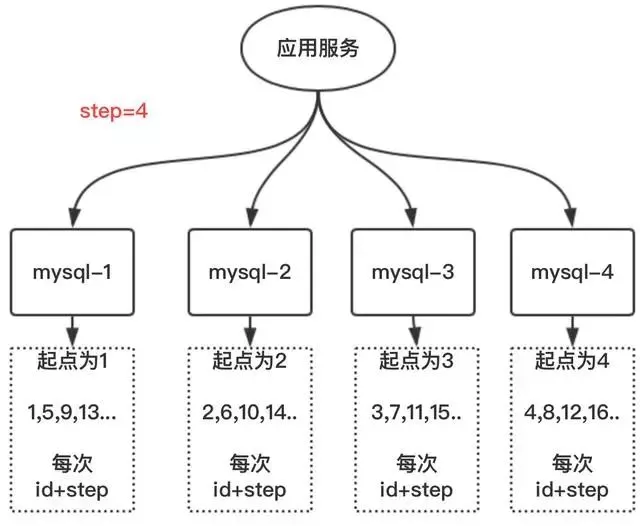
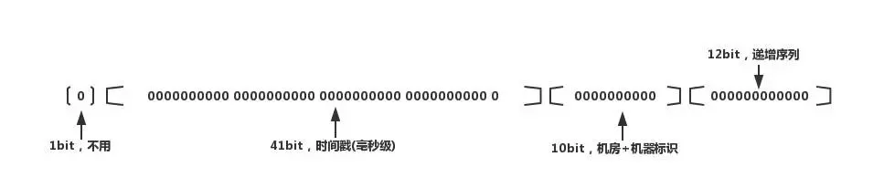

#### 1.UUID
优点：  
1、代码实现简单。  
2、本机生成，没有性能问题  
3、因为是全球唯一的ID，所以迁移数据容易

缺点：  
1、每次生成的ID是无序的，无法保证趋势递增  
2、UUID的字符串存储，查询效率慢  
3、存储空间大  
4、ID本事无业务含义，不可读

应用场景 :  
 1、类似生成token令牌的场景  
 2、不适用一些要求有趋势递增的ID场景

#### 2.DB主键自增
优点：  
1、数字化，id递增  
2、查询效率高  
3、具有一定的业务可读

缺点：  
1、存在单点问题，如果mysql挂了，就没法生成iD了  
2、数据库压力大，高并发抗不住

#### 3.多实例主键自增
这个方案就是解决mysql的单点问题，在auto_increment基本上面，设置step步长

每台的初始值分别为1,2,3...N，步长为N（这个案例步长为4）

优点：  
解决了单点问题  

缺点：  
一旦把步长定好后，就无法扩容；而且单个数据库的压力大，数据库自身性能无法满足高并发

应用场景：  
数据不需要扩容的场景

#### 4.雪花snowflake算法

1、1位标识符：始终是0。  
2、41位时间戳：41位时间截不是存储当前时间的时间截，而是存储时间截的差值（当前时间截 - 开始时间截 )得到的值，这里的的开始时间截，一般是我们的id生成器开始使用的时间，由我们程序来指定的。  
3、10位机器标识码：可以部署在1024个节点，如果机器分机房（IDC）部署，这10位可以由 5位机房ID + 5位机器ID 组成。  
4、12位序列：毫秒内的计数，12位的计数顺序号支持每个节点每毫秒(同一机器，同一时间截)产生4096个ID序号  

优点：  
1、此方案每秒能够产生409.6万个ID，性能快  
2、时间戳在高位，自增序列在低位，整个ID是趋势递增的，按照时间有序递增  
3、灵活度高，可以根据业务需求，调整bit位的划分，满足不同的需求

缺点：  
依赖机器的时钟，如果服务器时钟回拨，会导致重复ID生成

在分布式场景中，服务器时钟回拨会经常遇到，一般存在10ms之间的回拨；小伙伴们就说这点10ms，很短可以不考虑吧。但此算法就是建立在毫秒级别的生成方案，一旦回拨，就很有可能存在重复ID。

#### 5.Redis生成方案
利用redis的incr原子性操作自增，一般算法为：  
年份 + 当天距当年第多少天 + 天数 + 小时 + redis自增
优点：

有序递增，可读性强

缺点：

占用带宽，每次要向redis进行请求

整体测试了这个性能如下：

需求：同时10万个请求获取ID

1、并发执行完耗时：9s左右  
2、单任务平均耗时：74ms  
3、单线程最小耗时：不到1ms  
4、单线程最大耗时：4.1s
