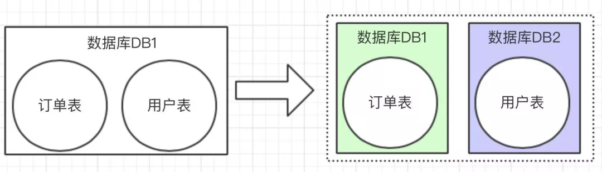
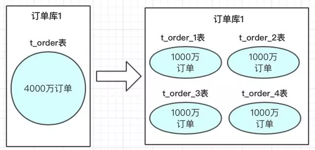
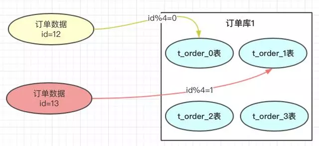
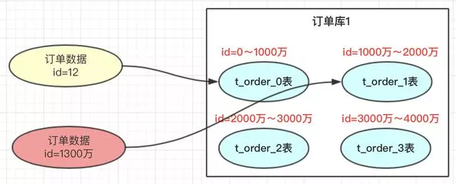
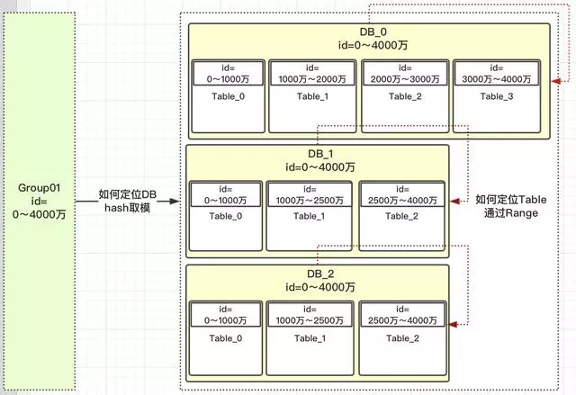
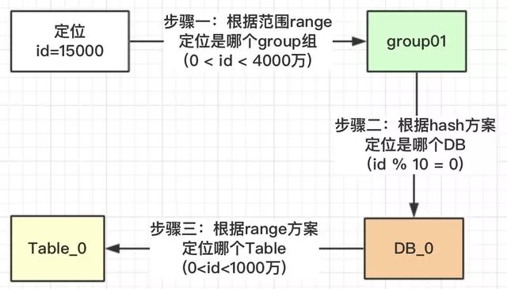
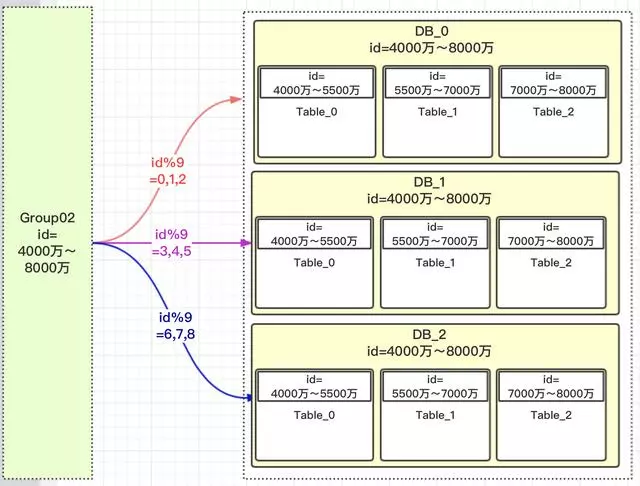
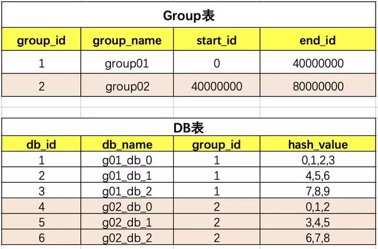
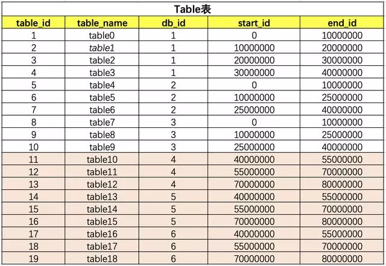

#### 1.简介
中大型项目中，一旦遇到数据量比较大，小伙伴应该都知道就应该对数据进行拆分了。有垂直和水平两种。

垂直拆分比较简单，也就是本来一个数据库，数据量大之后，从业务角度进行拆分多个库。如下图，独立的拆分出订单库和用户库。

水平拆分的概念，是同一个业务数据量大之后，进行水平拆分。

上图中订单数据达到了4000万，我们也知道mysql单表存储量推荐是百万级，如果不进行处理，mysql单表数据太大，会导致性能变慢。使用方案可以参考数据进行水平拆分。把4000万数据拆分4张表或者更多。当然也可以分库，再分表；把压力从数据库层级分开。
#### 2.方案
分库分表方案中有常用的方案，hash取模和range范围方案；分库分表方案最主要就是路由算法，把路由的key按照指定的算法进行路由存放。下边来介绍一下两个方案的特点。
- hash取模方案：没有热点问题，但扩容迁移数据痛苦
- range方案：不需要迁移数据，但有热点问题。

##### 2.1 hash

在我们设计系统之前，可以先预估一下大概这几年的订单量，如：4000万。每张表我们可以容纳1000万，也我们可以设计4张表进行存储。

优点：订单数据可以均匀的放到那4张表中，这样此订单进行操作时，就不会有热点问题。
缺点：将来的数据迁移和扩容，会很难。
##### 2.2 range范围方案
range方案也就是以范围进行拆分数据，比较简单，就是把一定范围内的订单，存放到一个表中；如上图id=12放到0表中，id=1300万的放到1表中。设计这个方案时就是前期把表的范围设计好。通过id进行路由存放。

优点：  
我们小伙伴们想一下，此方案是不是有利于将来的扩容，不需要做数据迁移。即时再增加4张表，之前的4张表的范围不需要改变，id=12的还是在0表，id=1300万的还是在1表，新增的4张表他们的范围肯定是 大于 4000万之后的范围划分的。

缺点：  
有热点问题，我们想一下，因为id的值会一直递增变大，那这段时间的订单是不是会一直在某一张表中，如id=1000万 ～ id=2000万之间，这段时间产生的订单是不是都会集中到此张表中，这个就导致1表过热，压力过大，而其他的表没有什么压力。

#### 3.二者结合
hash是可以解决数据均匀的问题，range可以解决数据迁移问题，我们考虑一下数据的扩容代表着，路由key（如id）的值变大了，这个是一定的，那我们先保证数据变大的时候，首先用range方案让数据落地到一个范围里面。这样以后id再变大，那以前的数据是不需要迁移的。
但又要考虑到数据均匀，那是不是可以在一定的范围内数据均匀的呢？因为我们每次的扩容肯定会事先设计好这次扩容的范围大小，我们只要保证这次的范围内的数据均匀是不是就ok了。

我们先定义一个group组概念，这组里面包含了一些分库以及分表，如下图

##### 3.1 流程

##### 3.2 扩容
扩容的时候再设计一个group02组，定义好此group的数据范围就ok了。

因为是新增的一个group01组，所以就没有什么数据迁移概念，完全是新增的group组，而且这个group组照样就防止了热点，也就是【4000万，5500万】的数据，都均匀分配到三个DB的table_0表中，【5500万～7000万】数据均匀分配到table_1表中。

#### 4.系统设计
思路确定了，设计是比较简单的，就3张表，把group，DB，table之间建立好关联关系就行了。

