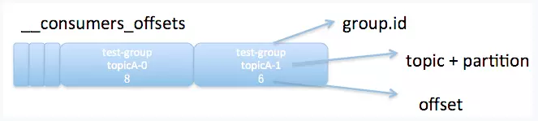
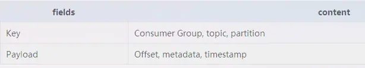
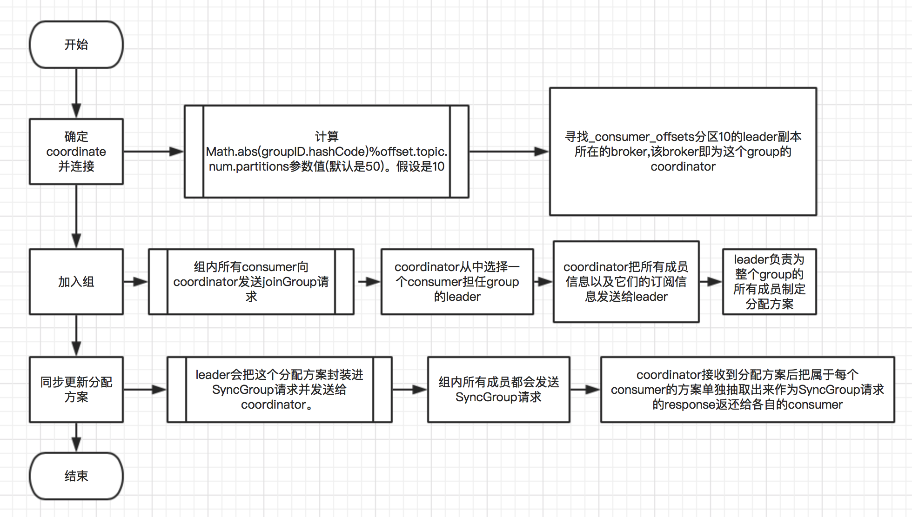
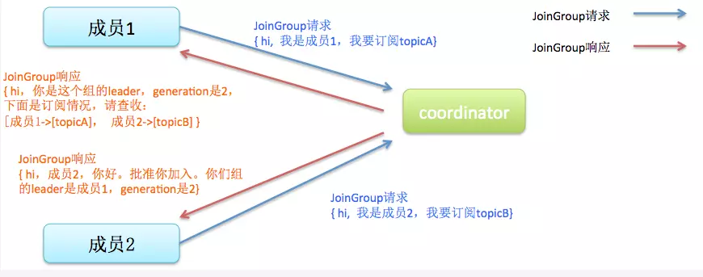
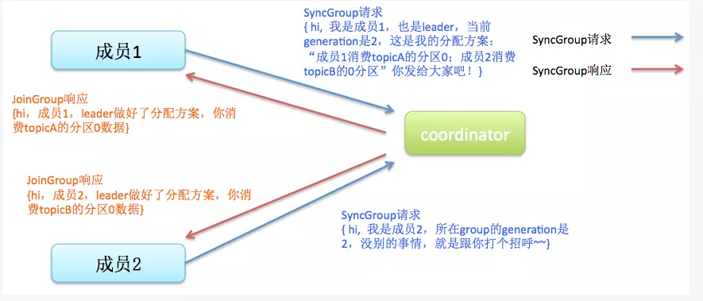

#### 1.consumer_offsets
- 目的：保存Kafka消费者的位移信
- 格式：：<<Group ID，主题名，分区号>，offset>




#### 2.Coordinator
##### 2.1 broker
- GroupCoordinator:每个kafka server都有一个实例，管理部分的consumer group和它们的offset
- WorkerCoordinator:管理GroupCoordinator程序，主要管理workers的分配

```
1、所有的consumer线程要先向coordinator注册，由coordinator选出leader, 然后由leader来分配state。 从group memeber里选出来一个做为leader，由leader来执行性能开销大的协调任务, 这样把负载分配到client端，可以减轻broker的压力，支持更多数量的消费组。
2、所有group member(指的是consumer线程)都需要发心跳给coordinator，这样coordinator才能确定group的成员。
3、对于Kafka consumer，它的实际上必须跟coordinator保持连接，因为它还需要提交offset给coordinator。所以coordinator实际上负责commit offset，那么，即使leader来确定状态的分配，但是每个partition的消费起始点，还需要coordinator来确定。
```
##### 2.2 consumer
ConsumerCoordinator是KafkaConsumer的一个成员变量，所以每个消费者都要自己的ConsumerCoordinator，消费者的ConsumerCoordintor只是和服务端的GroupCoordinator通信的介质

##### 2.3 Group Coordinator定位

```
__consumers_offsets partition# = Math.abs(groupId.hashCode() % groupMetadataTopicPartitionCount)
```   
注意：groupMetadataTopicPartitionCount由offsets.topic.num.partitions指定，默认是50个分区。

#### 3.Reblance
- 条件
 - 组成员数量发生变化
 - 订阅主题数量发生变化
 - 订阅主题的分区数发生变化
- 影响参数
 - session.timeout.ms
 - heartbeat.interval.ms
 - max.poll.interval.ms
 - GC参数
- 过程

 - 所有成员都向coordinator发送JoinGroup请求，请求入组。一旦所有成员都发送了JoinGroup请求，coordinator会从中选择一个consumer担任leader的角色，并把组成员信息以及订阅信息发给leader——注意leader和coordinator不是一个概念。leader负责消费分配方案的制定

 
 - leader开始分配消费方案，即哪个consumer负责消费哪些topic的哪些partition。一旦完成分配，leader会将这个方案封装进SyncGroup请求中发给coordinator，非leader也会发SyncGroup请求，只是内容为空。coordinator接收到分配方案之后会把方案塞进SyncGroup的response中发给各个consumer。这样组内的所有成员就都知道自己应该消费哪些分区。

 
