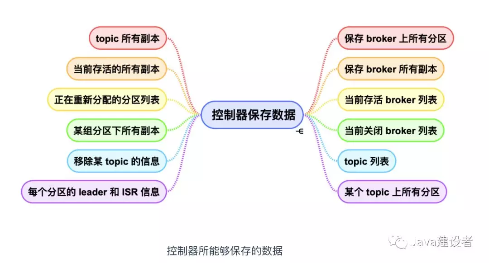
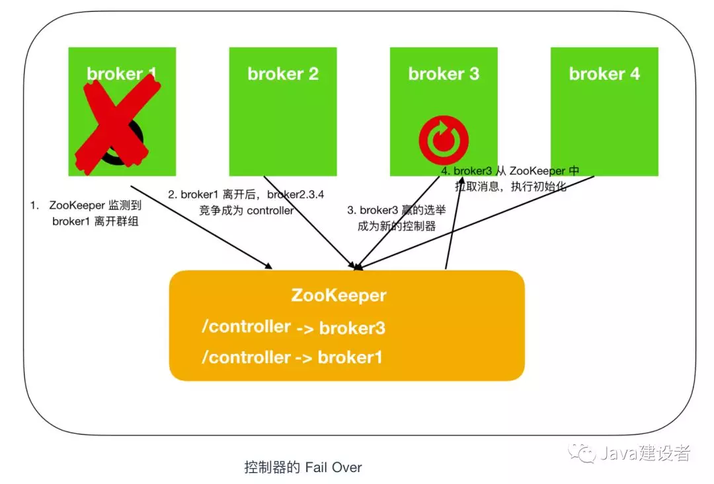
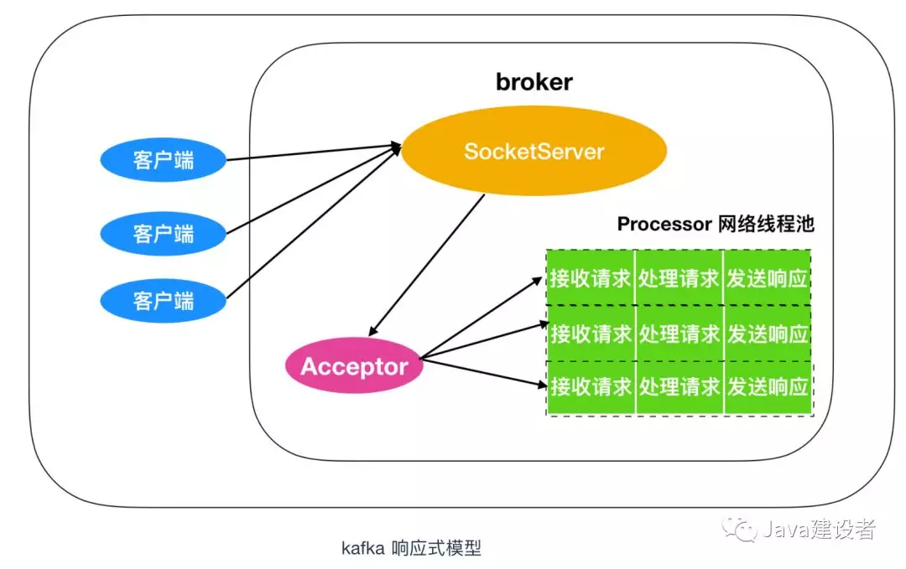
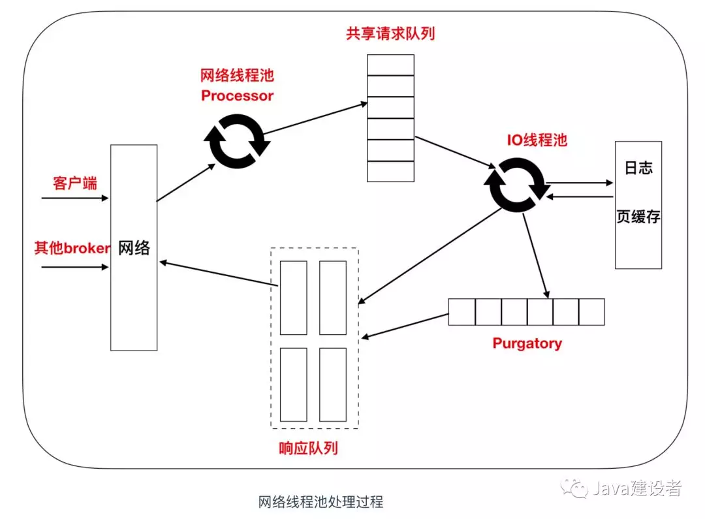
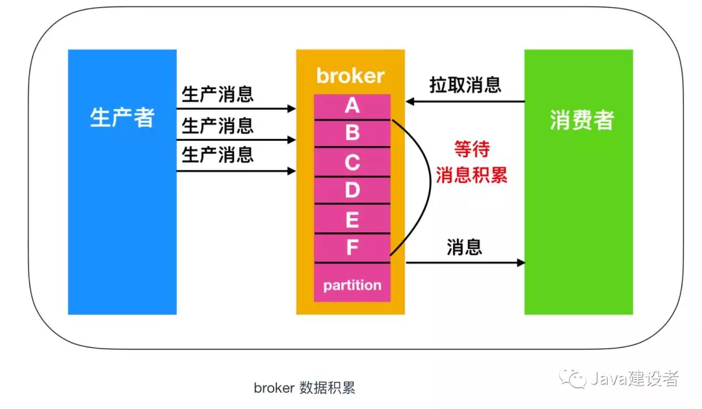

#### 1、broker
Kafka 在启动时会在 ZooKeeper 中 /brokers/ids 路径下注册一个与当前 broker 的 id 相同的临时节点。Kafka 的健康状态检查就依赖于此节点。当有 broker 加入集群或者退出集群时，这些组件就会获得通知
- 如果你要启动另外一个具有相同 ID 的 broker，那么就会得到一个错误 —— 新的 broker 会试着进行注册，但不会成功，因为 ZooKeeper 里面已经有一个相同 ID 的 broker。
- 在 broker 停机、出现分区或者长时间垃圾回收停顿时，broker 会从 ZooKeeper 上断开连接，此时 broker 在启动时创建的临时节点会从 ZooKeeper 中移除。监听 broker 列表的 Kafka 组件会被告知该 broker 已移除。
- 在关闭 broker 时，它对应的节点也会消失，不过它的 ID 会继续存在其他数据结构中，例如主题的副本列表中，副本列表复制我们下面再说。在完全关闭一个 broker 之后，如果使用相同的 ID 启动另一个全新的 broker，它会立刻加入集群，并拥有一个与旧 broker 相同的分区和主题。
#### 2、controller
在 ZooKeeper 的帮助下管理和协调整个 Kafka 集群，集群中的每个 broker 都可以称为 controller，但是在 Kafka 集群启动后，只有一个 broker 会成为 Controller 。
##### 2.1 选举
Kafka 集群中第一个启动的 broker 通过在 ZooKeeper 里创建一个临时节点 /controller 让自己成为 controller 控制器。其他 broker 在启动时也会尝试创建这个节点，但是由于这个节点已存在，所以后面想要创建 /controller 节点时就会收到一个 节点已存在 的异常。然后其他 broker 会在这个控制器上注册一个 ZooKeeper 的 watch 对象，/controller 节点发生变化时，其他 broker 就会收到节点变更通知。
##### 2.2 作用
- 主题管理：Kafka 主题创建、删除和增加分区的操作
- 分区重分配: 分区重分配主要是指，kafka-reassign-partitions 脚本提供的对已有主题分区进行细粒度的分配功能。这部分功能也是控制器实现的。
- Prefered 领导者选举 : Preferred 领导者选举主要是 Kafka 为了避免部分 Broker 负载过重而提供的一种换 Leader 的方案。
- 集群成员管理: 主要管理 新增 broker、broker 关闭、broker 宕机
- 数据服务: 控制器的最后一大类工作，就是向其他 broker 提供数据服务。控制器上保存了最全的集群元数据信息，其他所有 broker 会定期接收控制器发来的元数据更新请求，从而更新其内存中的缓存数据。

当控制器发现一个 broker 离开集群（通过观察相关 ZooKeeper 路径），控制器会收到消息：这个 broker 所管理的那些分区需要一个新的 Leader。控制器会依次遍历每个分区，确定谁能够作为新的 Leader，然后向所有包含新 Leader 或现有 Follower 的分区发送消息，该请求消息包含谁是新的 Leader 以及谁是 Follower 的信息。随后，新的 Leader 开始处理来自生产者和消费者的请求，Follower 用于从新的 Leader 那里进行复制。

当控制器发现一个 broker 加入集群时，它会使用 broker ID 来检查新加入的 broker 是否包含现有分区的副本。如果有控制器就会把消息发送给新加入的 broker 和 现有的 broker。

##### 2.3 数据存储

- broker 上的所有信息，包括 broker 中的所有分区，broker 所有分区副本，当前都有哪些运行中的 broker，哪些正在关闭中的 broker 。
- 所有主题信息，包括具体的分区信息，比如领导者副本是谁，ISR 集合中有哪些副本等。
- 所有涉及运维任务的分区。包括当前正在进行 Preferred 领导者选举以及分区重分配的分区列表。

Kafka 是离不开 ZooKeeper的，所以这些数据信息在 ZooKeeper 中也保存了一份。每当控制器初始化时，它都会从 ZooKeeper 上读取对应的元数据并填充到自己的缓存中。

##### 2.4 故障转移
我们在前面说过，第一个在 ZooKeeper 中的 /brokers/ids下创建节点的 broker 作为 broker controller，也就是说 broker controller 只有一个，那么必然会存在单点失效问题。kafka 为考虑到这种情况提供了故障转移功能，也就是 Fail Over。如下图

最一开始，broker1 会抢先注册成功成为 controller，然后由于网络抖动或者其他原因致使 broker1 掉线，ZooKeeper 通过 Watch 机制觉察到 broker1 的掉线，之后所有存活的 brokers 开始竞争成为 controller，这时 broker3 抢先注册成功，此时 ZooKeeper 存储的 controller 信息由 broker1 -> broker3，之后，broker3 会从 ZooKeeper 中读取元数据信息，并初始化到自己的缓存中。
```
注意：ZooKeeper 中存储的不是缓存信息，broker 中存储的才是缓存信息。
```

#### 3.读写请求
Kafka 采用的是 TCP 基于 Socket 的方式进行通讯
##### 3.1 响应式模型

Kafka 的 broker 端有个 SocketServer组件，类似于处理器，SocketServer 是基于 TCP 的 Socket 连接的，它用于接受客户端请求，所有的请求消息都包含一个消息头，消息头中都包含如下信息
- Request type （也就是 API Key）
- Request version（broker 可以处理不同版本的客户端请求，并根据客户版本做出不同的响应）
- Correlation ID --- 一个具有唯一性的数字，用于标示请求消息，同时也会出现在响应消息和错误日志中（用于诊断问题）
- Client ID --- 用于标示发送请求的客户端

broker 会在它所监听的每一个端口上运行一个 Acceptor 线程，这个线程会创建一个连接，并把它交给 Processor(网络线程池)， Processor 的数量可以使用 num.network.threads 进行配置，其默认值是3，表示每台 broker 启动时会创建3个线程，专门处理客户端发送的请求。

Acceptor 线程会采用轮询的方式将入栈请求公平的发送至网络线程池中，因此，在实际使用过程中，这些线程通常具有相同的机率被分配到待处理请求队列中，然后从响应队列获取响应消息，把它们发送给客户端。Processor 网络线程池中的请求 - 响应的处理还是比较复杂的，下面是网络线程池中的处理流程图

Processor 网络线程池接收到客户和其他 broker 发送来的消息后，网络线程池会把消息放到请求队列中，注意这个是共享请求队列，因为网络线程池是多线程机制的，所以请求队列的消息是多线程共享的区域，然后由 IO 线程池进行处理，根据消息的种类判断做何处理，比如 PRODUCE 请求，就会将消息写入到 log 日志中，如果是FETCH请求，则从磁盘或者页缓存中读取消息。也就是说，IO线程池是真正做判断，处理请求的一个组件。在IO 线程池处理完毕后，就会判断是放入响应队列中还是 Purgatory 中，Purgatory 是什么我们下面再说，现在先说一下响应队列，响应队列是每个线程所独有的，因为响应式模型中不会关心请求发往何处，因此把响应回传的事情就交给每个线程了，所以也就不必共享了。
##### 3.2 请求类型
###### 3.2.1 生产请求
如果 acks = 1，那么只要领导者收到消息就表示写入成功，如果acks = 0，表示只要领导者发送消息就表示写入成功，根本不用考虑返回值的影响。如果 acks = all，就表示领导者需要收到所有副本的消息后才表示写入成功。

在消息被写入分区的首领后，如果 acks 配置的值是 all，那么这些请求会被保存在 炼狱(Purgatory)的缓冲区中，直到领导者副本发现跟随者副本都复制了消息，响应才会发送给客户端。
###### 3.2.2 获取请求
broker 获取请求的方式与处理生产请求的方式类似，客户端发送请求，向 broker 请求主题分区中特定偏移量的消息，如果偏移量存在，Kafka 会采用 零复制 技术向客户端发送消息，Kafka 会直接把消息从文件中发送到网络通道中，而不需要经过任何的缓冲区，从而获得更好的性能。

客户端可以设置获取请求数据的上限和下限，上限指的是客户端为接受足够消息分配的内存空间，这个限制比较重要，如果上限太大的话，很有可能直接耗尽客户端内存。下限可以理解为攒足了数据包再发送的意思，这就相当于项目经理给程序员分配了 10 个bug，程序员每次改一个 bug 就会向项目经理汇报一下，有的时候改好了有的时候可能还没改好，这样就增加了沟通成本和时间成本，所以下限值得就是程序员你改完10个 bug 再向我汇报！！！如下图所示


###### 3.2.3 元数据请求
生产请求和响应请求都必须发送给领导者副本，如果 broker 收到一个针对某个特定分区的请求，而该请求的首领在另外一个 broker 中，那么发送请求的客户端会收到非分区首领的错误响应；如果针对某个分区的请求被发送到不含有领导者的 broker 上，也会出现同样的错误。Kafka 客户端需要把请求和响应发送到正确的 broker 上。这不是废话么？我怎么知道要往哪发送？

事实上，客户端会使用一种 元数据请求 ，这种请求会包含客户端感兴趣的主题列表，服务端的响应消息指明了主题的分区，领导者副本和跟随者副本。元数据请求可以发送给任意一个 broker，因为所有的 broker 都会缓存这些信息。

一般情况下，客户端会把这些信息缓存，并直接向目标 broker 发送生产请求和相应请求，这些缓存需要隔一段时间就进行刷新，使用metadata.max.age.ms 参数来配置，从而知道元数据是否发生了变更。比如，新的 broker 加入后，会触发重平衡，部分副本会移动到新的 broker 上。这时候，如果客户端收到 不是首领的错误，客户端在发送请求之前刷新元数据缓存。
