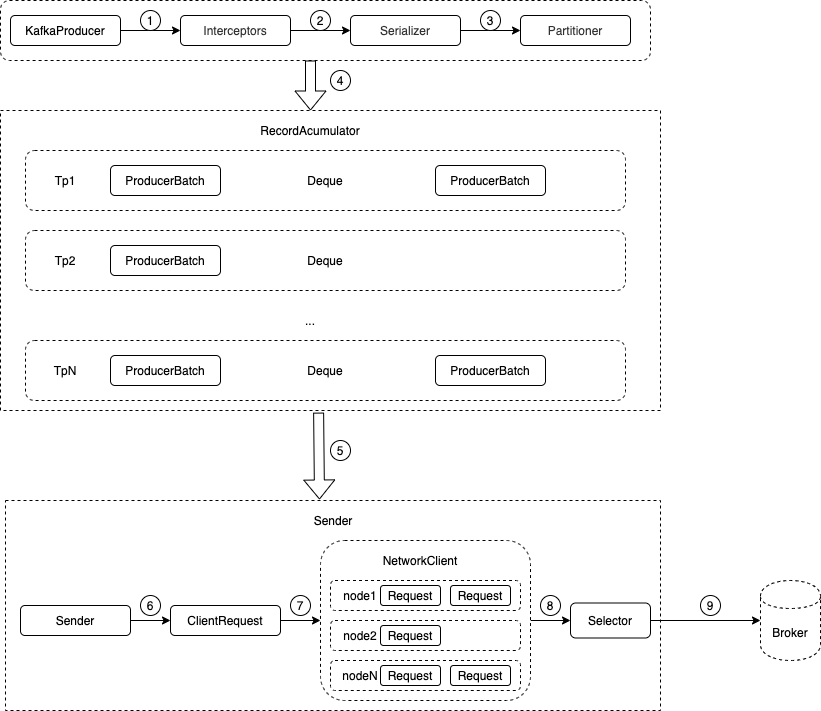
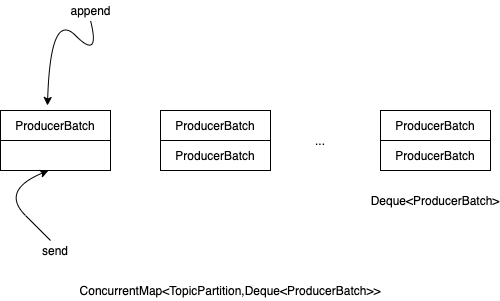
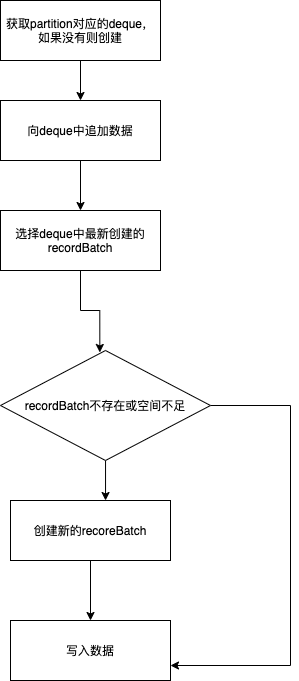

#### 1、Producer使用
```java
public class Producer extends Thread {
    private final KafkaProducer<Integer, String> producer;
    private final String topic;
    private final Boolean isAsync;

    public Producer(String topic, Boolean isAsync) {
        Properties props = new Properties();
        props.put("bootstrap.servers", KafkaProperties.KAFKA_SERVER_URL + ":" + KafkaProperties.KAFKA_SERVER_PORT);
        props.put("client.id", "DemoProducer");
        props.put("key.serializer", "org.apache.kafka.common.serialization.IntegerSerializer");
        props.put("value.serializer", "org.apache.kafka.common.serialization.StringSerializer");
        producer = new KafkaProducer<>(props);
        this.topic = topic;
        this.isAsync = isAsync;
    }

    public void run() {
        int messageNo = 1;
        while (true) {
            String messageStr = "Message_" + messageNo;
            long startTime = System.currentTimeMillis();
            if (isAsync) { // Send asynchronously
                producer.send(new ProducerRecord<>(topic,
                    messageNo,
                    messageStr), new DemoCallBack(startTime, messageNo, messageStr));
            } else { // Send synchronously
                try {
                    producer.send(new ProducerRecord<>(topic,
                        messageNo,
                        messageStr)).get();
                    System.out.println("Sent message: (" + messageNo + ", " + messageStr + ")");
                } catch (InterruptedException | ExecutionException e) {
                    e.printStackTrace();
                }
            }
            ++messageNo;
        }
    }
}

class DemoCallBack implements Callback {

    private final long startTime;
    private final int key;
    private final String message;

    public DemoCallBack(long startTime, int key, String message) {
        this.startTime = startTime;
        this.key = key;
        this.message = message;
    }

    /**
     * A callback method the user can implement to provide asynchronous handling of request completion. This method will
     * be called when the record sent to the server has been acknowledged. Exactly one of the arguments will be
     * non-null.
     *
     * @param metadata  The metadata for the record that was sent (i.e. the partition and offset). Null if an error
     *                  occurred.
     * @param exception The exception thrown during processing of this record. Null if no error occurred.
     */
    public void onCompletion(RecordMetadata metadata, Exception exception) {
        long elapsedTime = System.currentTimeMillis() - startTime;
        if (metadata != null) {
            System.out.println(
                "message(" + key + ", " + message + ") sent to partition(" + metadata.partition() +
                    "), " +
                    "offset(" + metadata.offset() + ") in " + elapsedTime + " ms");
        } else {
            exception.printStackTrace();
        }
    }
}
```
- 初始化KafkaProducer
- 调用send发送数据

#### 2、Producer发送消息流程

```
在Producer端存在两个线程，一个producer,调用send发送消息，send方法即刻返回，数据被缓存到RecdordAccumulator中，另一个调用sender线程，其不断轮询RecdordAccumulator，满足一定条件后，就进行真正的网络IO发送
```
##### 2.1 Producer send
用户通过调用producer.send发送的数据，最终实现还是调用了 Producer 的 doSend() 接口
```java
private Future<RecordMetadata> doSend(ProducerRecord<K, V> record, Callback callback) {
        TopicPartition tp = null;
        try {
            // 1、first make sure the metadata for the topic is available
            ClusterAndWaitTime clusterAndWaitTime = waitOnMetadata(record.topic(), record.partition(), maxBlockTimeMs);
            long remainingWaitMs = Math.max(0, maxBlockTimeMs - clusterAndWaitTime.waitedOnMetadataMs);
            Cluster cluster = clusterAndWaitTime.cluster;
            // 2、序列化record的key和value
            byte[] serializedKey;
            try {
                serializedKey = keySerializer.serialize(record.topic(), record.headers(), record.key());
            } catch (ClassCastException cce) {
                throw new SerializationException("Can't convert key of class " + record.key().getClass().getName() +
                        " to class " + producerConfig.getClass(ProducerConfig.KEY_SERIALIZER_CLASS_CONFIG).getName() +
                        " specified in key.serializer", cce);
            }
            byte[] serializedValue;
            try {
                serializedValue = valueSerializer.serialize(record.topic(), record.headers(), record.value());
            } catch (ClassCastException cce) {
                throw new SerializationException("Can't convert value of class " + record.value().getClass().getName() +
                        " to class " + producerConfig.getClass(ProducerConfig.VALUE_SERIALIZER_CLASS_CONFIG).getName() +
                        " specified in value.serializer", cce);
            }
            // 3、获取该record的partition
            int partition = partition(record, serializedKey, serializedValue, cluster);
            tp = new TopicPartition(record.topic(), partition);

            setReadOnly(record.headers());
            Header[] headers = record.headers().toArray();

            int serializedSize = AbstractRecords.estimateSizeInBytesUpperBound(apiVersions.maxUsableProduceMagic(),
                    compressionType, serializedKey, serializedValue, headers);
            ensureValidRecordSize(serializedSize);
            long timestamp = record.timestamp() == null ? time.milliseconds() : record.timestamp();
            log.trace("Sending record {} with callback {} to topic {} partition {}", record, callback, record.topic(), partition);
            // producer callback will make sure to call both 'callback' and interceptor callback
            Callback interceptCallback = this.interceptors == null ? callback : new InterceptorCallback<>(callback, this.interceptors, tp);

            if (transactionManager != null && transactionManager.isTransactional())
                transactionManager.maybeAddPartitionToTransaction(tp);
            // 4、向accumulator写入数据
            RecordAccumulator.RecordAppendResult result = accumulator.append(tp, timestamp, serializedKey,
                    serializedValue, headers, interceptCallback, remainingWaitMs);
            //5、如果batch已经满了则唤醒sender线程发送数据
            if (result.batchIsFull || result.newBatchCreated) {
                log.trace("Waking up the sender since topic {} partition {} is either full or getting a new batch", record.topic(), partition);
                this.sender.wakeup();
            }
            return result.future;
            // handling exceptions and record the errors;
            // for API exceptions return them in the future,
            // for other exceptions throw directly
        } catch (ApiException e) {
            log.debug("Exception occurred during message send:", e);
            if (callback != null)
                callback.onCompletion(null, e);
            this.errors.record();
            if (this.interceptors != null)
                this.interceptors.onSendError(record, tp, e);
            return new FutureFailure(e);
        } catch (InterruptedException e) {
            this.errors.record();
            if (this.interceptors != null)
                this.interceptors.onSendError(record, tp, e);
            throw new InterruptException(e);
        } catch (BufferExhaustedException e) {
            this.errors.record();
            this.metrics.sensor("buffer-exhausted-records").record();
            if (this.interceptors != null)
                this.interceptors.onSendError(record, tp, e);
            throw e;
        } catch (KafkaException e) {
            this.errors.record();
            if (this.interceptors != null)
                this.interceptors.onSendError(record, tp, e);
            throw e;
        } catch (Exception e) {
            // we notify interceptor about all exceptions, since onSend is called before anything else in this method
            if (this.interceptors != null)
                this.interceptors.onSendError(record, tp, e);
            throw e;
        }
    }
```
- 1、确保要发送Topic的元数据信息可用，如果没有相关元数据信息则fetch;
- 2、序列化recor在的key和value;
- 3、获取record的partition;
- 4、往accumulator写入数据，若recordBatch满时则唤醒sender线程发送数据；

##### 2.2 获取元数据信息
###### 2.2.1 metadata数据结构
```java
public final class Metadata {
    // metadata更新时间间隔
    private final long refreshBackoffMs;
    // metadata过期时间
    private final long metadataExpireMs;
    // 每更新一次元数据，version自增1
    private int version;
    private long lastRefreshMs;
    private long lastSuccessfulRefreshMs;
    private AuthenticationException authenticationException;
    // topic相关信息（leader 所在节点、replica 所在节点、isr 列表
    private Cluster cluster;
    private boolean needUpdate;
    /* Topics with expiry time */
    private final Map<String, Long> topics;
    private final List<Listener> listeners;
    private final ClusterResourceListeners clusterResourceListeners;
    private boolean needMetadataForAllTopics;
    private final boolean allowAutoTopicCreation;
    // 默认为 true, Producer 会定时移除过期的 topic,consumer 则不会移除
    private final boolean topicExpiryEnabled;
  }
```
###### 2.2.2 cluster数据结构
cluster主要保存
- broker.id 与 node 的对应关系；
- topic 与 partition （PartitionInfo）的对应关系；
- ode 与 partition （PartitionInfo）的对应关系。
```java
public final class Cluster {
    private final boolean isBootstrapConfigured;
    private final List<Node> nodes;
    private final Set<String> unauthorizedTopics;
    private final Set<String> internalTopics;
    private final Node controller;
    private final Map<TopicPartition, PartitionInfo> partitionsByTopicPartition;
    private final Map<String, List<PartitionInfo>> partitionsByTopic;
    private final Map<String, List<PartitionInfo>> availablePartitionsByTopic;
    private final Map<Integer, List<PartitionInfo>> partitionsByNode;
    private final Map<Integer, Node> nodesById;
    private final ClusterResource clusterResource
  }
```

###### 2.2.3 metadata更新机制
(1)周期性的更新: 每隔一段时间更新一次，这个通过 Metadata的lastRefreshMs, lastSuccessfulRefreshMs 这2个字段来实现

(2) 失效检测，强制更新：检查到metadata失效以后，调用metadata.requestUpdate()强制更新。 requestUpdate()函数里面其实什么都没做，就是把needUpdate置成了false(如发送数据时，发现当前partition没有相关metadata)

###### 2.2.4 Producer 的 Metadata 更新流程
- 1、waitOnMetadata
```java
private ClusterAndWaitTime waitOnMetadata(String topic, Integer partition, long maxWaitMs) throws InterruptedException {
    // add topic to metadata topic list if it is not there already and reset expiry
    // 在 metadata 中添加 topic 后,如果 metadata 中没有这个 topic 的 meta，那么 metadata 的更新标志设置为了 true
    metadata.add(topic);
    Cluster cluster = metadata.fetch();
    // 如果 topic 已经存在 meta 中,则返回该 topic 的 partition 数,否则返回 null
    Integer partitionsCount = cluster.partitionCountForTopic(topic);
    // Return cached metadata if we have it, and if the record's partition is either undefined
    // or within the known partition range
    if (partitionsCount != null && (partition == null || partition < partitionsCount))
        return new ClusterAndWaitTime(cluster, 0);

    long begin = time.milliseconds();
    long remainingWaitMs = maxWaitMs;
    long elapsed;
    // Issue metadata requests until we have metadata for the topic or maxWaitTimeMs is exceeded.
    // In case we already have cached metadata for the topic, but the requested partition is greater
    // than expected, issue an update request only once. This is necessary in case the metadata
    // is stale and the number of partitions for this topic has increased in the meantime.
    do {
        log.trace("Requesting metadata update for topic {}.", topic);
        metadata.add(topic);
        int version = metadata.requestUpdate();
        // 唤起 sender，发送 metadata 请求
        sender.wakeup();
        try {
            metadata.awaitUpdate(version, remainingWaitMs);
        } catch (TimeoutException ex) {
            // Rethrow with original maxWaitMs to prevent logging exception with remainingWaitMs
            throw new TimeoutException("Failed to update metadata after " + maxWaitMs + " ms.");
        }
        cluster = metadata.fetch();
        elapsed = time.milliseconds() - begin;
        if (elapsed >= maxWaitMs)
            throw new TimeoutException("Failed to update metadata after " + maxWaitMs + " ms.");
        if (cluster.unauthorizedTopics().contains(topic))
            throw new TopicAuthorizationException(topic);
        remainingWaitMs = maxWaitMs - elapsed;
        partitionsCount = cluster.partitionCountForTopic(topic);
    } while (partitionsCount == null);

    if (partition != null && partition >= partitionsCount) {
        throw new KafkaException(
                String.format("Invalid partition given with record: %d is not in the range [0...%d).", partition, partitionsCount));
    }

    return new ClusterAndWaitTime(cluster, elapsed);
}
```
- 2、唤醒sender，通过NetworkClient.poll() 方法进行实际的操作
```Java
public List<ClientResponse> poll(long timeout, long now) {
       if (!abortedSends.isEmpty()) {
           // If there are aborted sends because of unsupported version exceptions or disconnects,
           // handle them immediately without waiting for Selector#poll.
           List<ClientResponse> responses = new ArrayList<>();
           handleAbortedSends(responses);
           completeResponses(responses);
           return responses;
       }

       long metadataTimeout = metadataUpdater.maybeUpdate(now);
       try {
           this.selector.poll(Utils.min(timeout, metadataTimeout, requestTimeoutMs));
       } catch (IOException e) {
           log.error("Unexpected error during I/O", e);
       }

       // process completed actions
       long updatedNow = this.time.milliseconds();
       List<ClientResponse> responses = new ArrayList<>();
       handleCompletedSends(responses, updatedNow);
       handleCompletedReceives(responses, updatedNow);
       handleDisconnections(responses, updatedNow);
       handleConnections();
       handleInitiateApiVersionRequests(updatedNow);
       handleTimedOutRequests(responses, updatedNow);
       completeResponses(responses);

       return responses;
   }
```

 - metadataUpdater.maybeUpdate(now)：判断是否需要更新 Metadata，如果需要更新的话，先与 Broker 建立连接，然后发送更新 metadata 的请求；
 - 处理 Server 端的一些响应，这里主要讨论的是 handleCompletedReceives(responses, updatedNow) 方法，它会处理 Server 端返回的 Metadata 结果。

- 3、maybeUpdate
```Java
public long maybeUpdate(long now) {
           // should we update our metadata?
           // metadata 下次更新的时间（需要判断是强制更新还是 metadata 过期更新,前者是立马更新,后者是计算 metadata 的过期时间）
           long timeToNextMetadataUpdate = metadata.timeToNextUpdate(now);
           // 如果一条 metadata 的 fetch 请求还未从 server 收到回复,那么时间设置为 waitForMetadataFetch（默认30s）
           long waitForMetadataFetch = this.metadataFetchInProgress ? requestTimeoutMs : 0;

           long metadataTimeout = Math.max(timeToNextMetadataUpdate, waitForMetadataFetch);
           if (metadataTimeout > 0) {
               // 时间未到时,直接返回下次应该更新的时间
               return metadataTimeout;
           }

           // Beware that the behavior of this method and the computation of timeouts for poll() are
           // highly dependent on the behavior of leastLoadedNode.
           // 选择一个连接数最小的节点
           Node node = leastLoadedNode(now);
           if (node == null) {
               log.debug("Give up sending metadata request since no node is available");
               return reconnectBackoffMs;
           }
           // 可以发送 metadata 请求的话,就发送 metadata 请求
           return maybeUpdate(now, node);
       }
```
```Java
       // 判断是否可以发送请求,可以的话将 metadata 请求加入到发送列表中
       private long maybeUpdate(long now, Node node) {
           String nodeConnectionId = node.idString();
           // 通道已经 ready 并且支持发送更多的请求
           if (canSendRequest(nodeConnectionId)) {
               // 准备开始发送数据,将 metadataFetchInProgress 置为 true
               this.metadataFetchInProgress = true;
               MetadataRequest.Builder metadataRequest;
               if (metadata.needMetadataForAllTopics())
                   // 强制更新所有 topic 的 metadata（虽然默认不会更新所有 topic 的 metadata 信息，但是每个 Broker 会保存所有 topic 的 meta 信息）
                   metadataRequest = MetadataRequest.Builder.allTopics();
               else
                   // 只更新 metadata 中的 topics 列表（列表中的 topics 由 metadata.add() 得到）
                   metadataRequest = new MetadataRequest.Builder(new ArrayList<>(metadata.topics()),
                           metadata.allowAutoTopicCreation());


               log.debug("Sending metadata request {} to node {}", metadataRequest, node);
               // 发送 metadata 请求
               sendInternalMetadataRequest(metadataRequest, nodeConnectionId, now);
               return requestTimeoutMs;
           }

           // If there's any connection establishment underway, wait until it completes. This prevents
           // the client from unnecessarily connecting to additional nodes while a previous connection
           // attempt has not been completed.
           if (isAnyNodeConnecting()) {
               // Strictly the timeout we should return here is "connect timeout", but as we don't
               // have such application level configuration, using reconnect backoff instead.
               return reconnectBackoffMs;
           }

           if (connectionStates.canConnect(nodeConnectionId, now)) {
               // we don't have a connection to this node right now, make one
               log.debug("Initialize connection to node {} for sending metadata request", node);
               initiateConnect(node, now);
               return reconnectBackoffMs;
           }

           // connected, but can't send more OR connecting
           // In either case, we just need to wait for a network event to let us know the selected
           // connection might be usable again.
           return Long.MAX_VALUE;
       }

   }
```

在send之前，会先读取metadata，如果 metadata 中不存在这个 topic 的 metadata，那么就请求更新 metadata，如果 metadata 没有更新的话，方法就一直处在 do ... while 的循环之中，在循环之中，主要做以下操作：

- 1、metadata.requestUpdate() 将 metadata 的 needUpdate 变量设置为 true（强制更新），并返回当前的版本号（version），通过版本号来判断 metadata 是否完成更新；
- 2、sender.wakeup() 唤醒 sender 线程，sender 线程又会去唤醒 NetworkClient 线程，发送更新元数据请求；
- 3、metadata.awaitUpdate(version, remainingWaitMs) 等待 metadata 的更新。


##### 2.3 accumulator 写数据

```java
public RecordAppendResult append(TopicPartition tp,
                                    long timestamp,
                                    byte[] key,
                                    byte[] value,
                                    Header[] headers,
                                    Callback callback,
                                    long maxTimeToBlock) throws InterruptedException {
       // We keep track of the number of appending thread to make sure we do not miss batches in
       // abortIncompleteBatches().
       appendsInProgress.incrementAndGet();
       ByteBuffer buffer = null;
       if (headers == null) headers = Record.EMPTY_HEADERS;
       try {
           // check if we have an in-progress batch
           // 获取partiton对应的deque，没有的话，创建一个空的queue
           Deque<ProducerBatch> dq = getOrCreateDeque(tp);
           synchronized (dq) {
               if (closed)
                   throw new IllegalStateException("Cannot send after the producer is closed.");
               // 向已有的recodeBatch追加数据
               RecordAppendResult appendResult = tryAppend(timestamp, key, value, headers, callback, dq);
               if (appendResult != null)
                   return appendResult;
           }

           // we don't have an in-progress record batch try to allocate a new batch
           byte maxUsableMagic = apiVersions.maxUsableProduceMagic();
           // 计算recodeBatch的大小
           int size = Math.max(this.batchSize, AbstractRecords.estimateSizeInBytesUpperBound(maxUsableMagic, compression, key, value, headers));
           log.trace("Allocating a new {} byte message buffer for topic {} partition {}", size, tp.topic(), tp.partition());
           // 给recordBatch分配空间
           buffer = free.allocate(size, maxTimeToBlock);
           synchronized (dq) {
               // Need to check if producer is closed again after grabbing the dequeue lock.
               if (closed)
                   throw new IllegalStateException("Cannot send after the producer is closed.");

               RecordAppendResult appendResult = tryAppend(timestamp, key, value, headers, callback, dq);
               if (appendResult != null) {
                   // Somebody else found us a batch, return the one we waited for! Hopefully this doesn't happen often...
                   return appendResult;
               }
               // 创建recordBatch
               MemoryRecordsBuilder recordsBuilder = recordsBuilder(buffer, maxUsableMagic);
               ProducerBatch batch = new ProducerBatch(tp, recordsBuilder, time.milliseconds());
               // 向recordBatch追加数据
               FutureRecordMetadata future = Utils.notNull(batch.tryAppend(timestamp, key, value, headers, callback, time.milliseconds()));
               // 将recordBatch追加到指定的dq内
               dq.addLast(batch);
               // 未ack的batch
               incomplete.add(batch);

               // Don't deallocate this buffer in the finally block as it's being used in the record batch
               buffer = null;
               // 如果dq.size()>1 就说明deque有个batch可以发送了
               return new RecordAppendResult(future, dq.size() > 1 || batch.isFull(), true);
           }
       } finally {
           if (buffer != null)
               free.deallocate(buffer);
           appendsInProgress.decrementAndGet();
       }
   }
```


##### 2.4 发送recordBatch
当 record 写入成功后,如dq.size() > 1 || batch.isFull(),则唤醒sender线程发送数据
```java
private long sendProducerData(long now) {
    Cluster cluster = metadata.fetch();

    // get the list of partitions with data ready to send
    // 获取那些已经可以发送的recordBatch对应的nodes
    RecordAccumulator.ReadyCheckResult result = this.accumulator.ready(cluster, now);

    // if there are any partitions whose leaders are not known yet, force metadata update
    // 如果找不到top partition的leader,则强制更新metadata
    if (!result.unknownLeaderTopics.isEmpty()) {
        // The set of topics with unknown leader contains topics with leader election pending as well as
        // topics which may have expired. Add the topic again to metadata to ensure it is included
        // and request metadata update, since there are messages to send to the topic.
        for (String topic : result.unknownLeaderTopics)
            this.metadata.add(topic);
        this.metadata.requestUpdate();
    }

    // remove any nodes we aren't ready to send to
    Iterator<Node> iter = result.readyNodes.iterator();
    long notReadyTimeout = Long.MAX_VALUE;
    while (iter.hasNext()) {
        Node node = iter.next();
        if (!this.client.ready(node, now)) {
            iter.remove();
            notReadyTimeout = Math.min(notReadyTimeout, this.client.connectionDelay(node, now));
        }
    }

    // create produce requests
    Map<Integer, List<ProducerBatch>> batches = this.accumulator.drain(cluster, result.readyNodes,
            this.maxRequestSize, now);
    if (guaranteeMessageOrder) {
        // Mute all the partitions drained
        for (List<ProducerBatch> batchList : batches.values()) {
            for (ProducerBatch batch : batchList)
                this.accumulator.mutePartition(batch.topicPartition);
        }
    }

    List<ProducerBatch> expiredBatches = this.accumulator.expiredBatches(this.requestTimeout, now);
    // Reset the producer id if an expired batch has previously been sent to the broker. Also update the metrics
    // for expired batches. see the documentation of @TransactionState.resetProducerId to understand why
    // we need to reset the producer id here.
    if (!expiredBatches.isEmpty())
        log.trace("Expired {} batches in accumulator", expiredBatches.size());
    for (ProducerBatch expiredBatch : expiredBatches) {
        failBatch(expiredBatch, -1, NO_TIMESTAMP, expiredBatch.timeoutException(), false);
        if (transactionManager != null && expiredBatch.inRetry()) {
            // This ensures that no new batches are drained until the current in flight batches are fully resolved.
            transactionManager.markSequenceUnresolved(expiredBatch.topicPartition);
        }
    }

    sensors.updateProduceRequestMetrics(batches);

    // If we have any nodes that are ready to send + have sendable data, poll with 0 timeout so this can immediately
    // loop and try sending more data. Otherwise, the timeout is determined by nodes that have partitions with data
    // that isn't yet sendable (e.g. lingering, backing off). Note that this specifically does not include nodes
    // with sendable data that aren't ready to send since they would cause busy looping.
    long pollTimeout = Math.min(result.nextReadyCheckDelayMs, notReadyTimeout);
    if (!result.readyNodes.isEmpty()) {
        log.trace("Nodes with data ready to send: {}", result.readyNodes);
        // if some partitions are already ready to be sent, the select time would be 0;
        // otherwise if some partition already has some data accumulated but not ready yet,
        // the select time will be the time difference between now and its linger expiry time;
        // otherwise the select time will be the time difference between now and the metadata expiry time;
        pollTimeout = 0;
    }
    // 将归属同一leader的recordBatch发送出去
    sendProduceRequests(batches, now);

    return pollTimeout;
}
```
- accumulator.ready()：遍历所有的 tp（topic-partition），如果其对应的 RecordBatch 可以发送（大小达到 batch.size 大小或时间达到 linger.ms），就将其对应的 leader 选出来，最后会返回一个可以发送 Produce request 的 Set<Node>（实际返回的是 ReadyCheckResult 实例，不过 Set<Node> 是最主要的成员变量）；
- 如果发现有 tp 没有 leader，那么这里就调用 requestUpdate() 方法更新 metadata，实际上还是在第一步对 tp 的遍历中，遇到没有 leader 的 tp 就将其加入到一个叫做 unknownLeaderTopics 的 set 中，然后会请求这个 tp 的 meta；
- accumulator.drain()：遍历每个 leader （第一步中选出）上的所有 tp，如果该 tp 对应的 RecordBatch 不在 backoff 期间（没有重试过，或者重试了但是间隔已经达到了 retryBackoffMs ），并且加上这个 RecordBatch 其大小不超过 maxSize（一个 request 的最大限制，默认为 1MB），那么就把这个 RecordBatch 添加 list 中，最终返回的类型为 Map<Integer, List<RecordBatch>>，key 为 leader.id，value 为要发送的 RecordBatch 的列表；
- sendProduceRequests()：发送 Produce 请求，这个方法会调用 NetworkClient.send() 来发送 clientRequest；
- NetworkClient.poll()：关于 socket 的 IO 操作都是在这个方法进行的，它还是调用 Selector 进行的相应操作，而 Selector 底层则是封装的 Java NIO 的相关接口。

在第三步中，可以看到，如果要向一个 leader 发送 Produce 请求，那么这 leader 对应 tp，如果其 RecordBatch 没有达到要求（batch.size 或 linger.ms 都没达到）还是可能会发送，这样做的好处是：可以减少 request 的频率，有利于提供发送效率。
