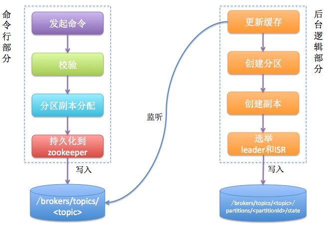

#### 1.topic创建
- 1、 脚本创建
通过 kafka-topics.sh 创建一个 topic，可以设置相应的副本数让 Server 端自动进行 replica 分配，也可以直接指定手动 replica 的分配
```
./bin/kafka-topics.sh --create --topic test --zookeeper XXXX --partitions 3 --replication-factor 2
```
- 2、Producer 创建 topic
只有当 Server 端的 auto.create.topics.enable 设置为 true 时，Producer 向一个不存在的 topic 发送数据，该 topic 才会被自动创建

#### 2.replica分配策略

- 1. 确定分区副本的分配方案(就是每个分区的副本都分配到哪些broker上)；2. 创建zookeeper节点，把这个方案写入/brokers/topics/<topic>节点下

- 2.Kafka controller部分主要做下面这些事情：1. 创建分区；2. 创建副本；3. 为每个分区选举leader、ISR；4.更新各种缓存

##### 2.1 手动指定
```
./bin/kafka-topics.sh --create --topic test --zookeeper XXXX --replica-assignment 1:2,3:4,5:6
```
该 topic 有三个 partition，其中，partition 0 的 replica 分布在1和2上，partition 1 的 replica 分布在3和4上，partition 2 的 replica 分布在5和6上
##### 2.2 自动分配
- 将所有N Broker和待分配的i个Partition排序.
- 将第i个Partition分配到第(i mod n)个Broker上.
- 将第i个Partition的第j个副本分配到第((i + j) mod n)个Broker上.
