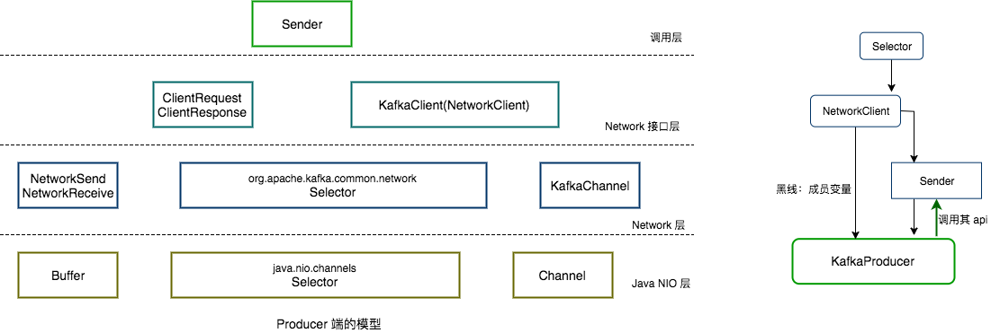

#### 1、网络通信模型
基于nio的reactor多线程模型设计，主要采用了1（1个Acceptor线程）+N（N个Processor线程）+M（M个业务处理线程）

|  线程数   | 线程名  |  说明  |
|  ----  | ----  | ----  |
|  1   | Acceptor  |  负责监听Client端发起的请求  |
|  N   | processor  |  负责对Socket进行读写  |
|  M   | work  |  处理具体的业务逻辑并生成Response返回  |


- 1、Acceptor：1个接收线程，负责监听新的连接请求，同时注册OP_ACCEPT 事件，将新的连接按照"round robin"方式交给对应的 Processor 线程处理;
- 2、Processor：N个处理器线程，其中每个 Processor 都有自己的 selector，它会向 Acceptor 分配的 SocketChannel 注册相应的 OP_READ 事件，N 的大小由“num.networker.threads”决定；
- 3、KafkaRequestHandler：M个请求处理线程，包含在线程池—KafkaRequestHandlerPool内部，从RequestChannel的全局请求队列—requestQueue中获取请求数据并交给KafkaApis处理，M的大小由“num.io.threads”决定；
- 4、RequestChannel：其为Kafka服务端的请求通道，该数据结构中包含了一个全局的请求队列 requestQueue和多个与Processor处理器相对应的响应队列responseQueue，提供给Processor与请求处理线程KafkaRequestHandler和KafkaApis交换数据的地方
- 5、NetworkClient：其底层是对 Java NIO 进行相应的封装，位于Kafka的网络接口层。Kafka消息生产者对象—KafkaProducer的send方法主要调用NetworkClient完成消息发送；
- 6、SocketServer：其是一个NIO的服务，它同时启动一个Acceptor接收线程和多个Processor处理器线程。提供了一种典型的Reactor多线程模式，将接收客户端请求和处理请求相分离；
- 7、KafkaServer：代表了一个Kafka Broker的实例；其startup方法为实例启动的入口；
- 8、KafkaApis：Kafka的业务逻辑处理Api，负责处理不同类型的请求；比如“发送消息”、“获取消息偏移量—offset”和“处理心跳请求”等；

##### 1.1 SocketServer
SocketServer是接收客户端Socket请求连接、处理请求并返回处理结果的核心类，Acceptor及Processor的初始化、处理逻辑都是在这里实现的。在KafkaServer实例启动时会调用其startup的初始化方法，会初始化1个 Acceptor和N个Processor线程（每个EndPoint都会初始化，一般来说一个Server只会设置一个端口），其实现如下：
```Java
def startup(startupProcessors: Boolean = true) {
  this.synchronized {

    connectionQuotas = new ConnectionQuotas(maxConnectionsPerIp, maxConnectionsPerIpOverrides)

    val sendBufferSize = config.socketSendBufferBytes
    val recvBufferSize = config.socketReceiveBufferBytes
    val brokerId = config.brokerId

    var processorBeginIndex = 0
    // 根据配置 listeners = PLAINTEXT://your.host.name:9092，配置协议、端口
    config.listeners.foreach { endpoint =>
      val listenerName = endpoint.listenerName
      val securityProtocol = endpoint.securityProtocol
      val processorEndIndex = processorBeginIndex + numProcessorThreads
      // 创建processor线程，线程数根据配置num.network.threads决定
      for (i <- processorBeginIndex until processorEndIndex)
        processors(i) = newProcessor(i, connectionQuotas, listenerName, securityProtocol, memoryPool)
      // 创建一个acceptor线程
      val acceptor = new Acceptor(endpoint, sendBufferSize, recvBufferSize, brokerId,
        processors.slice(processorBeginIndex, processorEndIndex), connectionQuotas)
      acceptors.put(endpoint, acceptor)
      KafkaThread.nonDaemon(s"kafka-socket-acceptor-$listenerName-$securityProtocol-${endpoint.port}", acceptor).start()
      acceptor.awaitStartup()

      processorBeginIndex = processorEndIndex
    }
    if (startupProcessors) {
      startProcessors()
    }
  }

  newGauge("NetworkProcessorAvgIdlePercent",
    new Gauge[Double] {
      private val ioWaitRatioMetricNames = processors.map { p =>
        metrics.metricName("io-wait-ratio", "socket-server-metrics", p.metricTags)
      }

      def value = ioWaitRatioMetricNames.map { metricName =>
        Option(metrics.metric(metricName)).fold(0.0)(_.value)
      }.sum / totalProcessorThreads
    }
  )
  newGauge("MemoryPoolAvailable",
    new Gauge[Long] {
      def value = memoryPool.availableMemory()
    }
  )
  newGauge("MemoryPoolUsed",
    new Gauge[Long] {
      def value = memoryPool.size() - memoryPool.availableMemory()
    }
  )
  info("Started " + acceptors.size + " acceptor threads")
}
```
##### 1.2 Acceptor
Acceptor的主要任务是监听并且接收客户端的请求，同时建立数据传输通道—SocketChannel，然后以轮询的方式交给一个后端的Processor线程处理（具体的方式是添加socketChannel至并发队列并唤醒Processor线程处理）
- 1、nioSelector：通过NSelector.open()方法创建的变量，封装了JAVA NIO Selector的相关操作；
- 2、serverChannel：用于监听端口的服务端Socket套接字对象；

###### 1.2.1 Acceptor.run()
```JAVA
def run() {
  // 注册OP_ACCEPT事件
  serverChannel.register(nioSelector, SelectionKey.OP_ACCEPT)
  startupComplete()
  try {
    var currentProcessor = 0
    // 以轮询方式查询并等待关注的事件发生
    while (isRunning) {
      try {
        val ready = nioSelector.select(500)
        if (ready > 0) {
          val keys = nioSelector.selectedKeys()
          val iter = keys.iterator()
          while (iter.hasNext && isRunning) {
            try {
              val key = iter.next
              iter.remove()
              if (key.isAcceptable)
                // 如果事件发生则调用accept方法对OP_ACCEPT事件处理
                accept(key, processors(currentProcessor))
              else
                throw new IllegalStateException("Unrecognized key state for acceptor thread.")

              // round robin to the next processor thread
              currentProcessor = (currentProcessor + 1) % processors.length
            } catch {
              case e: Throwable => error("Error while accepting connection", e)
            }
          }
        }
      }
      catch {
        // We catch all the throwables to prevent the acceptor thread from exiting on exceptions due
        // to a select operation on a specific channel or a bad request. We don't want
        // the broker to stop responding to requests from other clients in these scenarios.
        case e: ControlThrowable => throw e
        case e: Throwable => error("Error occurred", e)
      }
    }
  } finally {
    debug("Closing server socket and selector.")
    swallowError(serverChannel.close())
    swallowError(nioSelector.close())
    shutdownComplete()
  }
}
```

###### 1.2.2 Acceptor.accept()
```JAVA
def accept(key: SelectionKey, processor: Processor) {
    // 1、通过SelectionKey取得与之对应的serverSocketChannel实例
    val serverSocketChannel = key.channel().asInstanceOf[ServerSocketChannel]
    // 2、调用accept()方法与客户端建立连接
    val socketChannel = serverSocketChannel.accept()
    try {
      // 3、连接统计计数
      connectionQuotas.inc(socketChannel.socket().getInetAddress)
      // 4、设置socketChannel属性
      socketChannel.configureBlocking(false)
      socketChannel.socket().setTcpNoDelay(true)
      socketChannel.socket().setKeepAlive(true)
      if (sendBufferSize != Selectable.USE_DEFAULT_BUFFER_SIZE)
        socketChannel.socket().setSendBufferSize(sendBufferSize)

      debug("Accepted connection from %s on %s and assigned it to processor %d, sendBufferSize [actual|requested]: [%d|%d] recvBufferSize [actual|requested]: [%d|%d]"
            .format(socketChannel.socket.getRemoteSocketAddress, socketChannel.socket.getLocalSocketAddress, processor.id,
                  socketChannel.socket.getSendBufferSize, sendBufferSize,
                  socketChannel.socket.getReceiveBufferSize, recvBufferSize))
      // 5、调用processor.accept()
      processor.accept(socketChannel)
    } catch {
      case e: TooManyConnectionsException =>
        info("Rejected connection from %s, address already has the configured maximum of %d connections.".format(e.ip, e.count))
        close(socketChannel)
    }
  }
```
- 1、通过SelectionKey取得与之对应的serverSocketChannel实例；
- 2、调用accept()方法与客户端建立连接；
- 3、连接统计计数；
- 4、设置socketChannel属性；
- 5、调用processor.accept()将socketChannel加入Processor处理器的并发队列newConnections队列中，然后唤醒Processor线程从队列中获取socketChannel并处理。

##### 1.3 Processor
从客户端的请求中读取数据和将KafkaRequestHandler处理完响应结果返回给客户端
- 1、newConnections：ConcurrentLinkedQueue[SocketChannel]类型的队列，用于保存新连接交由Processor处理的socketChannel；
- 2、inflightResponses：是一个Map[String, RequestChannel.Response]类型的集合，用于记录尚未发送的响应；
- 3、selector：是一个类型为KSelector变量，用于管理网络连接；


#### 1、Producer网络模型
KafkaProducer通过Sender调用 NetworkClient来进行IO操作

