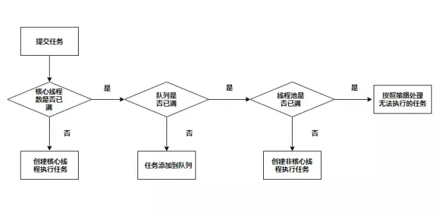

#### 1、简介
- 线程池的定义
- Executors创建线程池的几种方式
- ThreadPoolExecutor对象
- 线程池执行任务逻辑和线程池参数的关系
- Executors创建返回ThreadPoolExecutor对象
- OOM异常测试
- 如何定义线程池参数

#### 2、Executors创建线程池方法
- 创建返回ThreadPoolExecutor对象
- 创建返回ScheduleThreadPoolExecutor对象
- 创建返回ForkJoinPool对象

#### 3.ThreadPoolExecutor对象
```java
public ThreadPoolExecutor(int corePoolSize,
                          int maximumPoolSize,
                          long keepAliveTime,
                          TimeUnit unit,
                          BlockingQueue<Runnable> workQueue,
                          ThreadFactory threadFactory,
                          RejectedExecutionHandler handler)
```
构造函数参数说明：
- corePoolSize => 线程池核心线程数量
- maximumPoolSize => 线程池最大数量
- keepAliveTime => 空闲线程存活时间
- unit => 时间单位
- workQueue => 线程池所使用的缓冲队列
- threadFactory => 线程池创建线程使用的工厂
- handler => 线程池对拒绝任务的处理策略

线程池执行任务逻辑和线程池参数的关系

执行逻辑说明：
- 判断核心线程数是否已满，核心线程数大小和corePoolSize参数有关，未满则创建线程执行任务
- 若核心线程池已满，判断队列是否满，队列是否满和workQueue参数有关，若未满则加入队列中
- 若队列已满，判断线程池是否已满，线程池是否已满和maximumPoolSize参数有关，若未满创建线程执行任务
- 若线程池已满，则采用拒绝策略处理无法执执行的任务，拒绝策略和handler参数有关

#### 4、Executors创建返回ThreadPoolExecutor对象
##### 4.1 Executors#newCachedThreadPool方法
当一个任务提交时，corePoolSize为0不创建核心线程，SynchronousQueue是一个不存储元素的队列，可以理解为队里永远是满的，因此最终会创建非核心线程来执行任务。对于非核心线程空闲60s时将被回收。因为Integer.MAX_VALUE非常大，可以认为是可以无限创建线程的，在资源有限的情况下容易引起OOM异常
```java
public static ExecutorService newCachedThreadPool() {
    return new ThreadPoolExecutor(0, Integer.MAX_VALUE,
                                  60L, TimeUnit.SECONDS,
                                  new SynchronousQueue<Runnable>());
}
```
 - corePoolSize => 0，核心线程池的数量为0
 - maximumPoolSize => Integer.MAX_VALUE，可以认为最大线程数是无限的
 - keepAliveTime => 60L
 - unit => 秒
 - workQueue => SynchronousQueue

##### 4.2 Executors#newSingleThreadExecutor方法
 当一个任务提交时，首先会创建一个核心线程来执行任务，如果超过核心线程的数量，将会放入队列中，因为LinkedBlockingQueue是长度为Integer.MAX_VALUE的队列，可以认为是无界队列，因此往队列中可以插入无限多的任务，在资源有限的时候容易引起OOM异常，同时因为无界队列，maximumPoolSize和keepAliveTime参数将无效，压根就不会创建非核心线程
 ```java
 public static ExecutorService newFixedThreadPool(int nThreads) {
    return new ThreadPoolExecutor(nThreads, nThreads,
                                  0L, TimeUnit.MILLISECONDS,
                                  new LinkedBlockingQueue<Runnable>());
}
 ```
 - corePoolSize => 1，核心线程池的数量为1
 - maximumPoolSize => 1，只可以创建一个非核心线程
 - keepAliveTime => 0L
 - unit => 毫秒
 - workQueue => LinkedBlockingQueue

##### 4.3 Executors#newFixedThreadPool方法
SingleThreadExecutor类似，唯一的区别就是核心线程数不同，并且由于使用的是LinkedBlockingQueue，在资源有限的时候容易引起OOM异
```java
public static ExecutorService newFixedThreadPool(int nThreads) {
    return new ThreadPoolExecutor(nThreads, nThreads,
                                  0L, TimeUnit.MILLISECONDS,
                                  new LinkedBlockingQueue<Runnable>());
}
```
 - corePoolSize => 1，核心线程池的数量为1
 - maximumPoolSize => 1，只可以创建一个非核心线程
 - keepAliveTime => 0L
 - unit => 毫秒
 - workQueue => LinkedBlockingQueue

#### 5 如何定义线程池参数
- CPU密集型 => 线程池的大小推荐为CPU数量 + 1，CPU数量可以根据Runtime.availableProcessors方法获取
- IO密集型 => CPU数量 * CPU利用率 * (1 + 线程等待时间/线程CPU时间)
- 混合型 => 将任务分为CPU密集型和IO密集型，然后分别使用不同的线程池去处理，从而使每个线程池可以根据各自的工作负载来调整
- 阻塞队列 => 推荐使用有界队列，有界队列有助于避免资源耗尽的情况发生
- 拒绝策略 => 默认采用的是AbortPolicy拒绝策略，直接在程序中抛出RejectedExecutionException异常【因为是运行时异常，不强制catch】，这种处理方式不够优雅。处理拒绝策略有以下几种比较推荐：
 - 在程序中捕获RejectedExecutionException异常，在捕获异常中对任务进行处理。针对默认拒绝策略
 - 使用CallerRunsPolicy拒绝策略，该策略会将任务交给调用execute的线程执行【一般为主线程】，此时主线程将在一段时间内不能提交任何任务，从而使工作线程处理正在执行的任务。此时提交的线程将被保存在TCP队列中，TCP队列满将会影响客户端，这是一种平缓的性能降低
 - 自定义拒绝策略，只需要实现RejectedExecutionHandler接口即可
 - 如果任务不是特别重要，使用DiscardPolicy和DiscardOldestPolicy拒绝策略将任务丢弃也是可以的
如果使用Executors的静态方法创建ThreadPoolExecutor对象，可以通过使用Semaphore对任务的执行进行限流也可以避免出现OOM异常。
