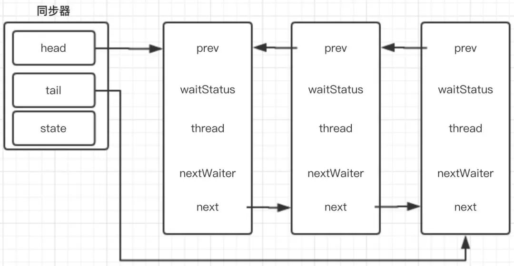
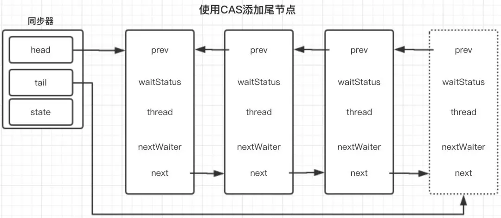
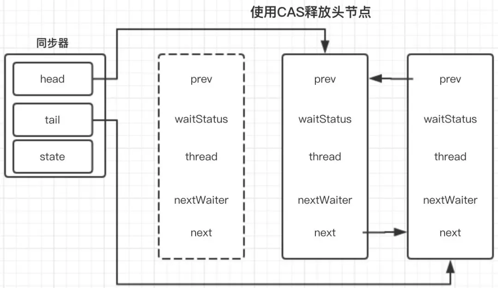

#### 1、简介
AQS通过内部实现的FIFO同步等待队列来完成资源获取线程的等待工作，如果当前线程获取资源失败，AQS则会将当前线程以及等待状态等信息构造成一个Node结构的节点，并将其加入等待队列中，同时会阻塞当前线程；当其它获取到资源的线程释放持有的资源时，则会把等待队列节点中的线程唤醒，使其再次尝试获取对应资源，其是CountDownLatch/FutureTask/ReentrantLock/RenntrantReadWriteLock/Semaphore实现的基础
#### 2、基本结构

- 插入节点


- 释放头结点



#### 3、ReentrantLock
- 非公平锁
```Java
final boolean nonfairTryAcquire(int acquires) {
    final Thread current = Thread.currentThread();
    int c = getState();//获取同步状态
    if (c == 0) {//同步状态为0，则直接尝试获取锁
        if (compareAndSetState(0, acquires)) {
            setExclusiveOwnerThread(current);
            return true;
        }
    }
    else if (current == getExclusiveOwnerThread()) {
        int nextc = c + acquires;
        if (nextc < 0) // overflow
            throw new Error("Maximum lock count exceeded");
        setState(nextc);
        return true;
    }
    return false;
}
```
- 公平锁
```Java
protected final boolean tryAcquire(int acquires) {
    final Thread current = Thread.currentThread();
    int c = getState();
    if (c == 0) {
        //需要判断队列中有没有等待的线程
        if (!hasQueuedPredecessors() &&
            compareAndSetState(0, acquires)) {
            setExclusiveOwnerThread(current);
            return true;
        }
    }
    else if (current == getExclusiveOwnerThread()) {
        int nextc = c + acquires;
        if (nextc < 0)
            throw new Error("Maximum lock count exceeded");
        setState(nextc);
        return true;
    }
    return false;
}
```

#### 4、Semaphore
通过AQS实现。Semaphore中定义了Sync抽象类，而Sync又继承了AbstractQueuedSynchronizer，Semaphore中对许可的获取与释放，是使用CAS通过对AQS中state的操作实现
