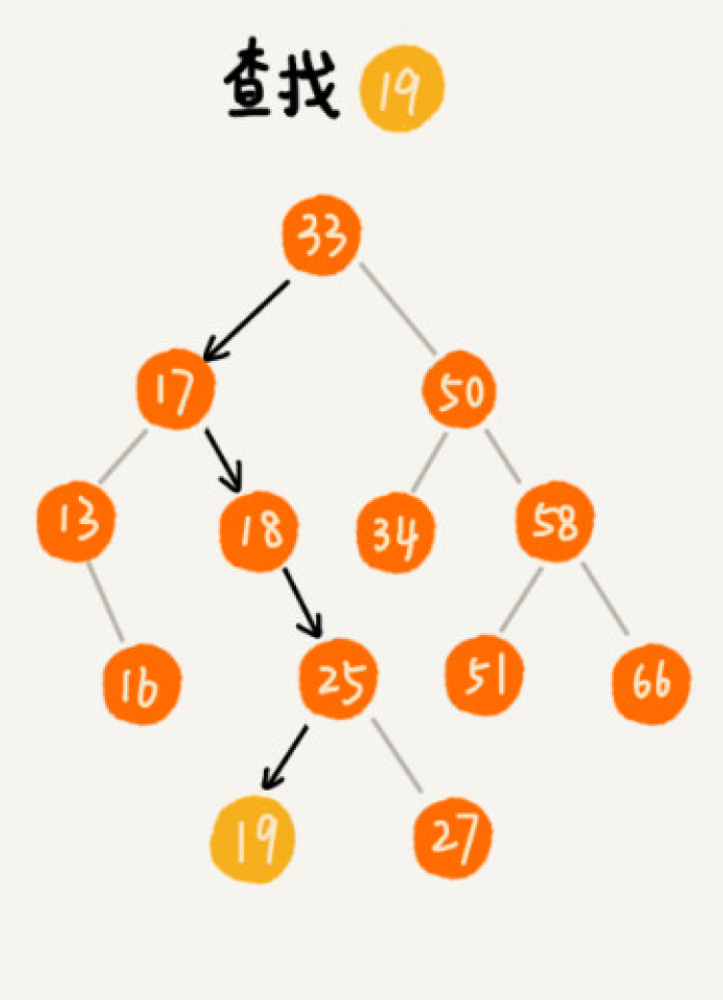
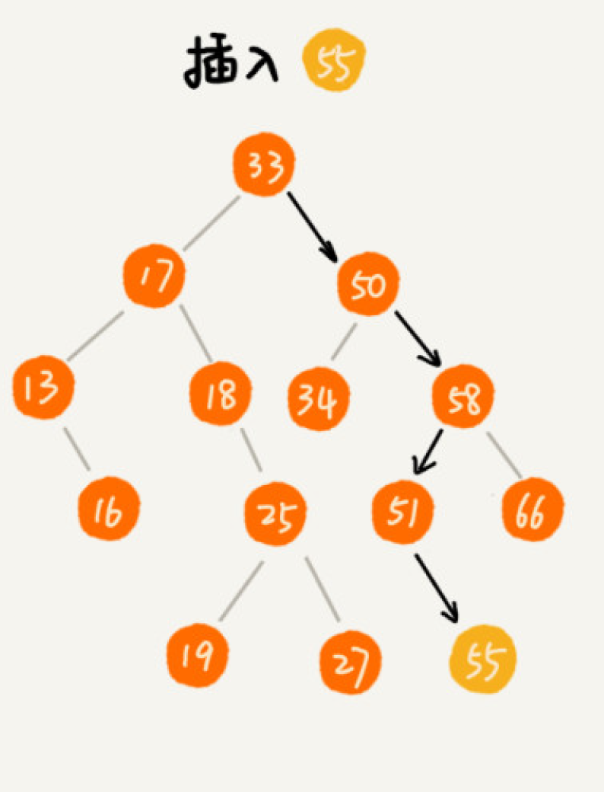
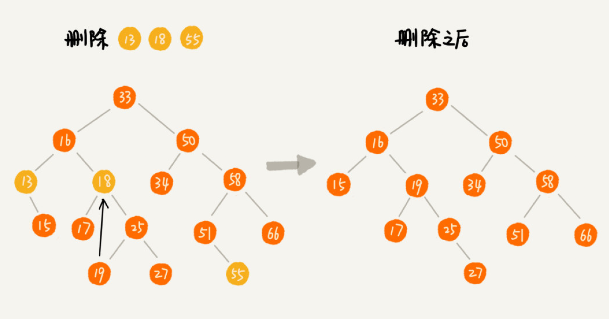

#### 1.概念
在树中的任意一个节点，其左子树中的每个节点的值，都要小于这个节点的值，而右子树节点的值都大于这个节点的值
#### 2.查找
先取根节点，如果它等于我们要查找的数据，那就返回。如果要查找的数据比根节点的值小，那就在左子树中递归查找；如果要查找的数据比根节点的值大，那就在右子树中递归查找。

#### 3.插入
从根节点开始，依次比较要插入的数据和节点的大小关系，如果要插入的数据比节点的数据大，并且节点的右子树为空，就将新数据直接插到右子节点的位置；如果不为空，就再递归遍历右子树，查找插入位置。同理，如果要插入的数据比节点数值小，并且节点的左子树为空，就将新数据插入到左子节点的位置；如果不为空，就再递归遍历左子树，查找插入位置。

#### 4.删除
- 无子节点：只需要直接将父节点中，指向要删除节点的指针置为 null
- 只有一个子节点：们只需要更新父节点中，指向要删除节点的指针，让它指向要删除节点的子节点
- 两个子节点：找到这个节点的右子树中的最小节点，把它替换到要删除的节点上。然后再删除掉这个最小节点

#### 5.与散列表比较
- 散列表中的数据是无序存储的，如果要输出有序的数据，需要先进行排序。而对于二叉查
找树来说，我们只需要中序遍历，就可以在 O(n) 的时间复杂度内，输出有序的数据序列。
- 散列表扩容耗时很多，而且当遇到散列冲突时，性能不稳定，尽管二叉查找树的性能不稳
定，但是在工程中，我们最常用的平衡二叉查找树的性能非常稳定，时间复杂度稳定在
O(logn)。
