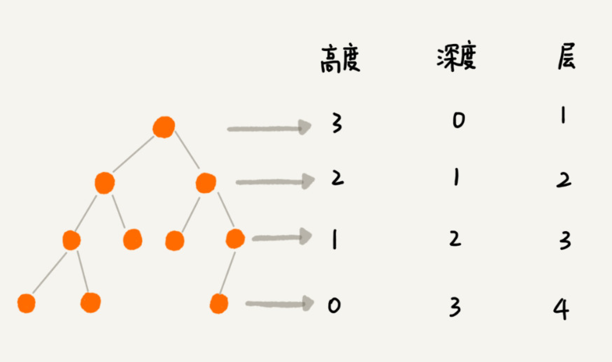
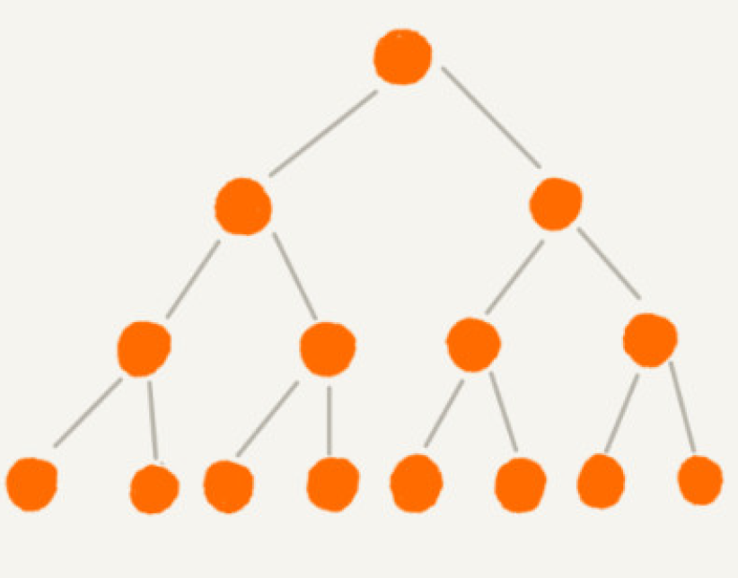
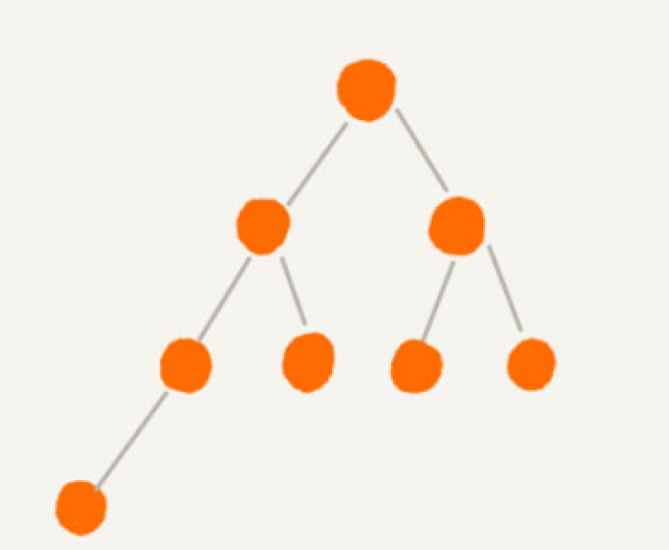
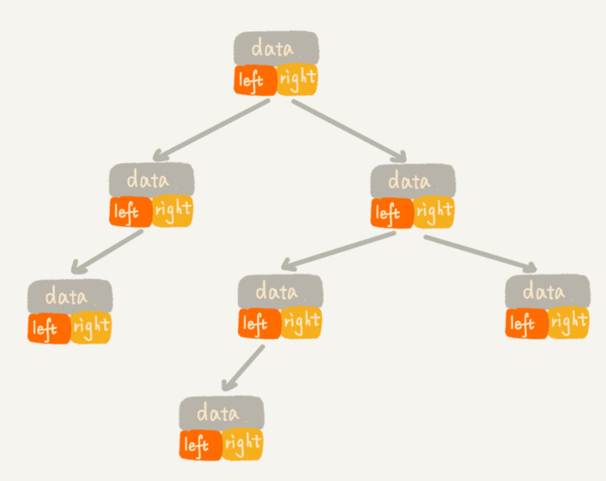
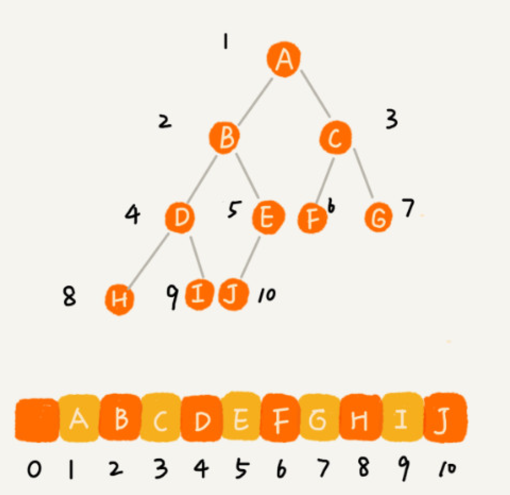
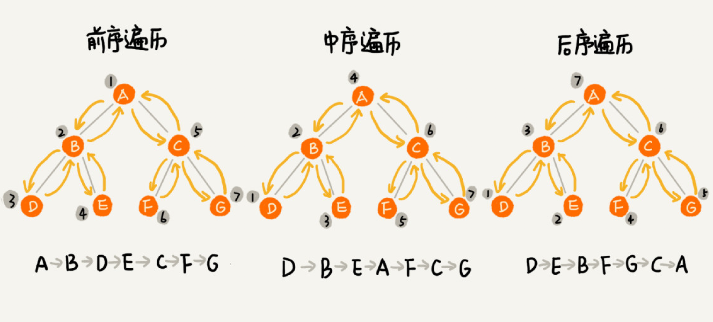

#### 1.基本概念

#### 2.分类
- 满二叉树：，叶子节点全都在最底层，除了叶子节点之外，每个节点都有左右两
个子节点

- 完全二叉树:叶子节点都在最底下两层，最后一层的叶子节点都靠左排列，并且除了最
后一层，其他层的节点个数都要达到最大

#### 3.数据存储
- 基于链表二叉链式

- 基于数据顺序存储  
如果节点 X 存储在数组中下标为 i 的位置，下标为 2 * i 的位置存储的就是左子
节点，下标为 2 * i + 1 的位置存储的就是右子节点。反过来，下标为 i/2 的位置存储就是它的
父节点。

#### 4.遍列
- 前序遍历是指，对于树中的任意节点来说，先打印这个节点，然后再打印它的左子树，最后
打印它的右子树。
- 中序遍历是指，对于树中的任意节点来说，先打印它的左子树，然后再打印它本身，最后打
印它的右子树。
- 后序遍历是指，对于树中的任意节点来说，先打印它的左子树，然后再打印它的右子树，最
后打印这个节点本身
- 层次遍列：从根节点开始，从上到下，从左到右

