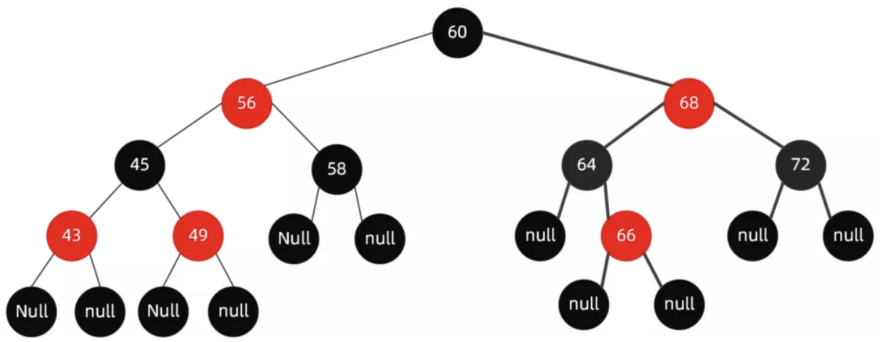

#### 1.基本规则
- 节点分为红色或者黑色。
- 根节点必为黑色。
- 叶子节点都为黑色，且为 null。
- 连接红色节点的两个子节点都为黑色（红黑树不会出现相邻的红色节点）。
- 从任意节点出发，到其每个叶子节点的路径中包含相同数量的黑色节点。
- 新加入到红黑树的节点为红色节点

#### 2.插入
当我们插入值为 66 的节点时，红黑树变成了这样

如果再向里面插入值为 51 的节点，这个时候红黑树变成了这样

